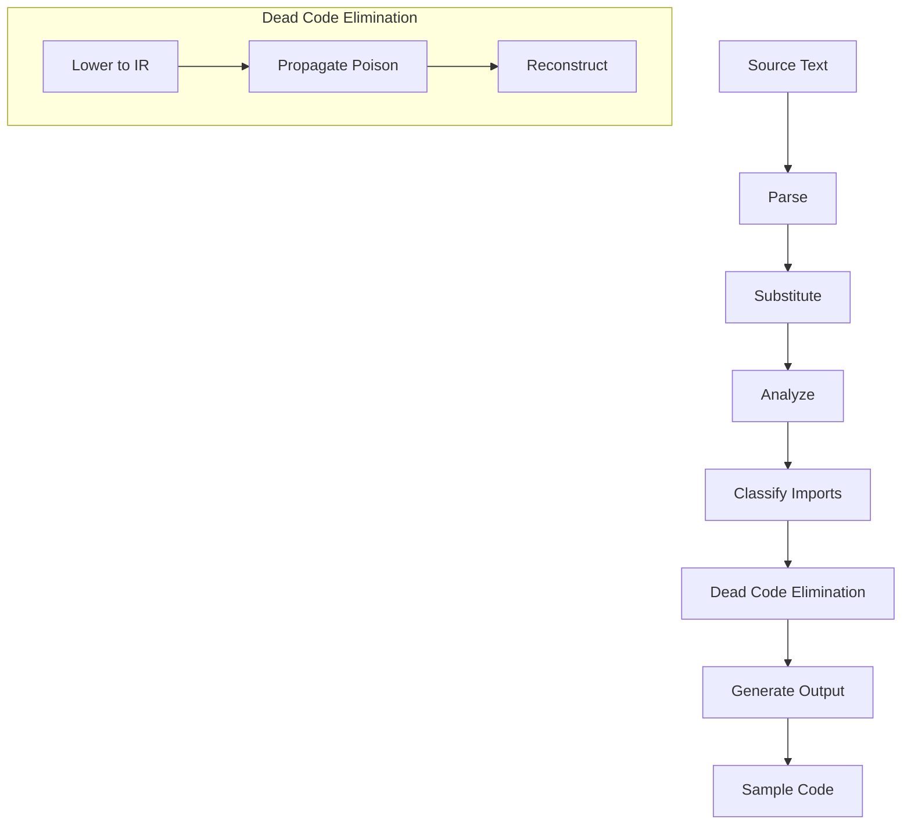
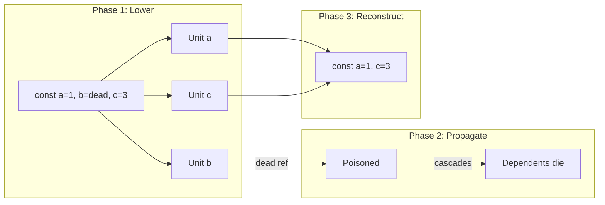

# Sample-Tests Compiler

Transforms vitest test files into publishable sample code.

## Quick Example

**Input (test file):**
```typescript
/** @summary Create a widget */
import { describe, it } from "vitest";
import { WidgetClient } from "../src/index.js";
import { forPublishing } from "@azure-tools/test-publishing";
import { NoOpCredential } from "@azure-tools/test-credential";
import { DefaultAzureCredential } from "@azure/identity";

describe("widget", () => {
  it("creates a widget", async () => {
    const credential = forPublishing(
      new NoOpCredential(),
      () => new DefaultAzureCredential()
    );
    const client = new WidgetClient(process.env.ENDPOINT, credential);
    await client.createWidget({ name: "sample" });
  });
});
```

**Output (sample):**
```typescript
/** @summary Create a widget */
import { WidgetClient } from "@azure/widget";
import { DefaultAzureCredential } from "@azure/identity";

async function main() {
  const credential = new DefaultAzureCredential();
  const client = new WidgetClient(process.env.ENDPOINT, credential);
  await client.createWidget({ name: "sample" });
}

main().catch(console.error);
```

---

## Author Contract

### Required Structure
- Top-level `/** @summary ... */` JSDoc
- Single `describe` block (no nesting)
- One or more `it` blocks

### Import Categories

| Category | Example | Behavior |
|----------|---------|----------|
| test | `vitest`, `@azure-tools/test-*` | Removed |
| sourceCode | `../src/index.js` | → package name |
| external | `@azure/identity` | Kept |

### Intrinsics

```typescript
// Swap values between test/sample
forPublishing(testValue, () => sampleValue)

// Include only in sample output
sampleOnly(() => sampleOnlyCode)
```

### Callback Parameters

Statements using callback params (like vitest's `ctx`) are automatically removed:

```typescript
beforeEach((ctx) => {
  ctx.onTestFinished(() => {});  // ← removed
  client = new Client();          // ← kept
});
```

---

## Pipeline



### Phases

1. **Parse** — Extract metadata, describe/it structure, callback params
2. **Substitute** — Replace `forPublishing`/`sampleOnly` with published values
3. **Analyze** — Build TypeScript symbol tables
4. **Classify** — Categorize imports, resolve helpers
5. **Eliminate** — Remove dead code per scope, cascade dependencies
6. **Generate** — Rewrite imports, assemble `main()`, add cleanup

---

## DCE Algorithm

Three-phase IR-based poison propagation:



### Classification Rules

| Condition | Status | Salvage? |
|-----------|--------|----------|
| Type-only declaration | Dead | No |
| References dead binding | Dead | Yes |
| References callback param | Dead | No |
| No dead references | Alive | — |
| Mixed live/dead refs | Error | — |

### Side-Effect Salvaging

Dead statements may have salvageable side effects:

```typescript
// Input:
expect(await client.send()).toBeDefined();
//     └──────────────────┘ salvaged

// Output:
await client.send();
```

Exception: callback param deaths don't salvage (entire statement is test infrastructure).

---

## Modules

| Module | Purpose |
|--------|---------|
| `compiler.ts` | Pipeline orchestration |
| `parser.ts` | vitest structure extraction |
| `substitutor.ts` | Intrinsic replacement |
| `deadBindingEliminator.ts` | DCE with poison propagation |
| `bindingAnalyzer.ts` | TypeScript symbol resolution |
| `importClassifier.ts` | Import categorization |
| `codeGenerator.ts` | Output assembly |
