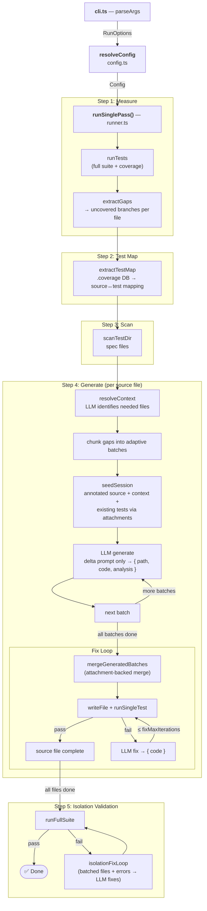

# @azure-tools/test-gen

Coverage-driven test generation tool for Azure SDK packages. Measures branch
coverage once, then generates targeted tests for all uncovered branches in a
single pass — producing one test file per source module.

## How It Works

The tool uses a **single-pass architecture**: measure once → generate all → verify.

### Step 1: Measure Coverage

Run the full test suite with branch coverage enabled. Parse the coverage data
to identify all uncovered branches, grouped by source file.

### Step 2: Build Test Map

Query the coverage database (`.coverage` SQLite DB or Istanbul JSON) to discover
which existing test files exercise which source files.

### Step 3: Resolve Context

For each source file with gaps, an LLM call identifies which other project files
are needed to understand the code (imports, types, schemas). Context selections
and existing-test snippets are cached in a package-local `.test-gen-cache.json`
file and reused when their input hashes have not changed. The context-resolution
prompt itself now sends the annotated source and source-file inventory as Copilot
SDK attachments instead of inlining them. When possible, the source attachment is
sent as a focused `selection` attachment around the uncovered regions rather than
as a whole-file payload.

### Step 4: Generate Tests

Uncovered branches are batched (default: 5 per LLM call, with adaptive upsizing
when prompt context is small). Each batch produces tests targeting specific
`⚠️ UNCOVERED BRANCH` markers in the annotated source. If a generation or merge
prompt times out, the tool automatically retries with smaller sub-batches
instead of dropping the file. After each successful generation batch, the tool
merges that batch into the target test file immediately, then runs the fix loop
before moving to the next batch.

For generation, `test-gen` now creates one durable Copilot SDK session per
source file and resumes it by stable session ID when possible. Static context
(annotated source, resolved context files, existing test snippets) is seeded
once into that per-file session using attachments, then later batch prompts send
only the current uncovered-marker delta.

During session creation, `test-gen` now also:

- isolates Copilot SDK session state under a package-local `.test-gen-copilot-sdk/`
  config directory
- garbage-collects stale durable `test-gen-*` sessions for the same package
- warms the SDK client with `ping()` and `listModels()`
- auto-selects a low-cost model for lightweight phases such as resolve/merge/seed
  using `listModels()` metadata, while keeping the configured generation/fix
  preference for heavier phases

### Step 5: Fix Loop

After each incremental merge, the generated file is written to disk and run.
If tests fail, the errors are sent back to the LLM for correction (up to
`fixMaxIterations` attempts) before the next batch is generated.

Merge, fix, and isolation-fix prompts also use Copilot SDK attachments for large
artifacts such as the current test file, generated batch files, source-under-test
files, and captured test errors. This keeps prompt text smaller while preserving
the same grounding.

For fix flows, `test-gen` prefers focused `selection` attachments around file
lines referenced in the failing output before falling back to whole-file attachments.

### Step 6: Full-Suite Isolation Validation

After all files are generated, the full test suite runs to detect cross-test
isolation issues (e.g., global state pollution). If failures are found, the
generated files are analyzed in smaller isolation-fix batches alongside the
full-suite error output. Each batch can return fixes only for the files it
contains, which avoids oversized prompts while still iterating toward a clean
full-suite run.

The system never modifies existing test files. Generated tests go into new
`test_<module>_gaps.<ext>` files.

## Quick Start

```bash
# From the repo root:

# 1. Build the target package
pnpm turbo build --filter=@azure/core-util... --token 1

# 2. Run the coverage-driven generation loop
node common/tools/test-gen/launch.js sdk/core/core-util

# 3. Dry-run: print generated tests to console without writing to disk
node common/tools/test-gen/launch.js sdk/core/core-util --dry-run
```

> Packages that list `@azure-tools/test-gen` as a devDependency get a `test-gen`
> binary in their `node_modules/.bin/` and can use `npx test-gen <dir>` instead.

### Programmatic API (Single-Pass)

```typescript
import { runSinglePass } from "@azure-tools/test-gen";

const result = await runSinglePass({
  packageDir: "/path/to/package",
  config: {
    runner: {
      command: "pytest tests/ --cov=mypackage --cov-branch --cov-report=json:coverage.json",
      coveragePath: "coverage.json",
      coverageFormat: "coveragepy",
      runSingle: "pytest $FILE -x -q",
      coverageDbPath: ".coverage",
    },
    paths: {
      testDir: "tests",
      sourcePrefix: "mypackage/",
      specExclusions: ["__pycache__", "conftest", "live"],
    },
    language: { testFramework: "pytest", outputExtension: ".py" },
    loop: { gapBatchSize: 5, maxGapFiles: 10, fixMaxIterations: 3, isolationBatchSize: 3 },
    llm: { model: "gpt-5.3-codex", fixModel: "gpt-5.3-codex" },
  },
  onProgress: console.log,
});

console.log(`Coverage: ${result.initialBranchCoverage}% → ${result.finalBranchCoverage}%`);
console.log(`Generated: ${result.generatedFiles.length} files, ${result.llmCalls} LLM calls`);
```

## CLI Usage

```
test-gen <package-dir> [options]
```

| Option | Description | Default |
|---|---|---|
| `--model <name>` | LLM model name | `gpt-5.3-codex` |
| `--concurrency <n>` | Process N source files in parallel | `1` |
| `--llm-concurrency <n>` | Limit concurrent LLM requests | `1` |
| `--dry-run` | Print generated tests to console without writing to disk | `false` |
| `--help` | Show help | |

Ctrl+C (SIGINT) gracefully aborts after the current iteration.

## Configuration

All behavior is controlled through a centralized `Config` object. The CLI maps
flags to config overrides; programmatic callers pass a partial config to
`runSinglePass()`. Every field has a default — only override what
you need.

```typescript
interface Config {
  runner: RunnerConfig;
  paths: PathsConfig;
  llm: LlmConfig;
  loop: LoopConfig;
  examples: ExamplesConfig;
  language: LanguageConfig;
}
```

### `runner` — Test execution

| Field | Type | Default | Description |
|---|---|---|---|
| `command` | `string` | `"npm run test:node"` | Shell command to run full test suite with coverage |
| `coveragePath` | `string` | `"coverage/coverage-final.json"` | Coverage JSON path (relative to packageDir) |
| `coverageFormat` | `string` | `"istanbul"` | Coverage data format: `"istanbul"` or `"coveragepy"` |
| `runSingle` | `string` | `"npm run test:node -- $FILE"` | Command to run a single test file (`$FILE` is replaced) |
| `coverageDbPath` | `string` | — | Path to `.coverage` SQLite DB for test map extraction |
| `timeout` | `number` | `120000` | Test execution timeout in ms |
| `maxBuffer` | `number` | `10485760` | Max stdout buffer in bytes (10 MB) |
| `tailLines` | `number` | `20` | Trailing stdout lines to display after a test run |

### `paths` — Directory and file conventions

| Field | Type | Default | Description |
|---|---|---|---|
| `testDir` | `string` | `"test"` | Test directory relative to packageDir |
| `sourcePrefix` | `string` | `"src/"` | Prefix to filter coverage entries to source files |
| `sourceExclusions` | `string[]` | `[]` | Substrings to exclude from source file discovery |
| `testExtensions` | `string[]` | `[".ts", ".js"]` | File extensions when scanning the test directory |
| `specSuffix` | `string` | `".spec.ts"` | Suffix identifying spec files for example picking |
| `specExclusions` | `string[]` | `["snippets", "node_modules"]` | Substrings to exclude from spec discovery |

### `llm` — LLM interaction

| Field | Type | Default | Description |
|---|---|---|---|
| `model` | `string` | `"gpt-5.3-codex"` | Model name for generation and context resolution |
| `fixModel` | `string` | — | Model name for fix loops (falls back to `model`) |
| `concurrency` | `number` | `1` | Maximum concurrent LLM requests |

Internally, `test-gen` also applies phase-specific Copilot SDK tuning:

- durable infinite sessions for per-file generation state
- `resumeSession()` for stable per-file session reuse across process restarts
- attachment strategies for large static artifacts, including focused `selection`
  attachments and small `directory` attachments where useful
- package-local `configDir` isolation for Copilot session state
- session GC using `listSessions()` / `deleteSession()`
- automatic low-cost model selection for lightweight phases via `listModels()`
- `reasoningEffort: "low"` for resolve/merge/seed and `"medium"` for generate/fix/isolation when the selected model supports it
- SDK hooks for conservative retry-on-recoverable model-call failures
- lifecycle telemetry for session creation/resume/compaction/model choice
- a custom `read_seed_artifact` tool available inside durable generation sessions
  so later batch prompts can reopen seeded artifacts on demand

### `loop` — Loop parameters

| Field | Type | Default | Description |
|---|---|---|---|
| `fixMaxIterations` | `number` | `3` | Maximum fix attempts per generated test file |
| `gapBatchSize` | `number` | `5` | Uncovered branches per LLM generation call |
| `maxGapFiles` | `number` | `20` | Maximum source files to process |
| `concurrency` | `number` | `1` | Source files to process in parallel (1 = sequential) |
| `isolationBatchSize` | `number` | `3` | Generated files per isolation-fix prompt |

### `examples` — Prompt building

| Field | Type | Default | Description |
|---|---|---|---|
| `maxLines` | `number` | `80` | Max lines to show from each example test file |
| `count` | `number` | `2` | Number of example test files to include in the prompt |

### `language` — Language-specific settings

Override these when targeting a non-JS/TS codebase. The code-fence language tag
for LLM prompts is derived automatically from `outputExtension`.

| Field | Type | Default | Description |
|---|---|---|---|
| `testFramework` | `string` | `"vitest"` | Test framework name used in prompts |
| `outputExtension` | `string` | `".ts"` | File extension for generated test output |

## Dataflow



**LLM calls per source file**

1. **resolveContext** — identifies which project files to include as context, with package-local caching and attachment-backed annotated source/file inventory
2. **seedSession** — seeds one durable per-file Copilot session with focused source selections + context + existing-test snippet attachments and the `read_seed_artifact` tool
3–N. **generate** `{ path, code, analysis, skipped_markers }` — one call per adaptive batch of uncovered branches, with timeout-triggered sub-batch retries
N+1. **merge** `{ code }` — one or more merge calls per source file when multiple batches exist or the file already exists, using attachment-backed existing/generated files and focused directories
N+2. **fix** `{ code }` — current merged file + source-under-test + error output via focused attachments *(only on failure)*

**Data sources**

| Source | Reader | Produces |
|---|---|---|
| `coverage.json` | `extractGaps` | branch-level gaps per source file |
| `.coverage` SQLite DB | `extractTestMap` | source file → existing test file mapping |
| test directory | `scanTestDir` | spec files, test folder tree |
| source files | `annotateSource` | source with `⚠️ UNCOVERED BRANCH` markers |

## Architecture

```
src/
├── cli.ts                    # CLI entry point (parseArgs + SIGINT handler)
├── config.ts                 # Config schema, defaults, resolveConfig()
├── runner.ts                 # runSinglePass(), merge, writeAndFix,
│                             # isolationFixLoop(), runFullSuite()
├── build-prompt.ts           # Generation seed + batch-delta prompt builders
├── extract-gaps.ts           # Coverage parser (Istanbul + coverage.py)
├── extract-test-map.ts       # .coverage SQLite DB → source↔test mapping
├── attachment-helpers.ts     # Focused selection/file attachment helpers
├── resolve-context.ts        # LLM-driven context file identification
├── annotate-source.ts        # Inline ⚠️ marker injection for uncovered branches
├── llm.ts                    # Copilot SDK sessions, attachments, resume(), tuning
├── node-sqlite.d.ts          # Type declarations for node:sqlite (Node 22+)
├── utils.ts                  # fileExists, tryReadFile
├── types.ts                  # Shared types (Pos, CoverageGap, RunReport, etc.)
├── index.ts                  # Public API barrel export
└── loop/
    ├── loop.ts               # Loop<T> + loop() — generic terminal loop
    └── index.ts              # Barrel re-exports
```

## Prerequisites

- The target package must produce a coverage JSON file in one of the supported
  formats: Istanbul (`coverage-final.json`) or coverage.py (`coverage json`).
  Set `runner.coverageFormat` accordingly.
- For test map extraction (recommended): a `.coverage` SQLite DB produced by
  `pytest --cov-context=test`. Set `runner.coverageDbPath`.
- GitHub Copilot must be authenticated (`gh auth login` or `GITHUB_TOKEN`).
- Node.js 22+ (required for `node:sqlite`) and pnpm.
