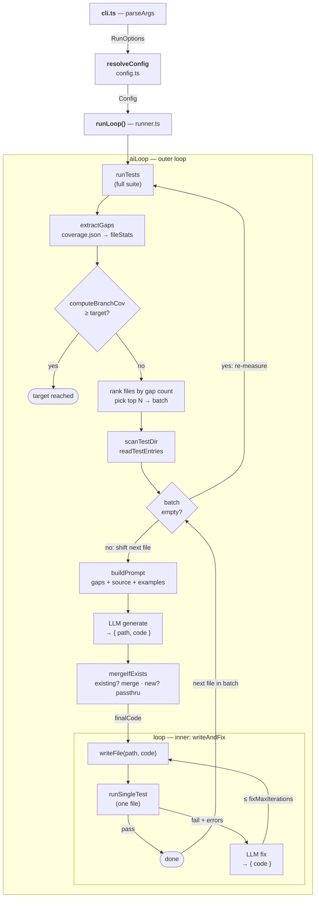

# @azure-tools/test-gen

Coverage-driven test generation tool for Azure SDK packages. Uses a two-level
AI loop to automatically generate tests that compile, run, and improve branch
coverage toward a configurable target.

## How It Works

**Measure phase** — run once per batch:

1. Run the full test suite with coverage
2. Parse coverage data and rank files by gap count
3. Pick the top N worst-covered files as a batch

**Generate phase** — one iteration per file in the batch:

4. Build a prompt from the gaps, source, conventions, and examples
5. LLM generates `{ path, code }` for the file
6. Merge with the existing test file (if any)
7. Write the test file to disk
8. Run the single test file
9. If tests fail → send errors to LLM → fix → repeat (up to `fixMaxIterations`)

**Then:** once the batch is drained, go back to step 1 and re-measure. If the
target is reached, stop.

The system never deletes or skips existing tests. When writing to a file that
already has tests, a merge step preserves all existing describe/it blocks
verbatim and appends new tests. The fix loop corrects failures without removing
any test cases.

## Quick Start

```bash
# From the repo root:

# 1. Build the target package
pnpm turbo build --filter=@azure/core-util... --token 1

# 2. Run the coverage-driven generation loop
node common/tools/test-gen/launch.js sdk/core/core-util

# 3. Dry-run: print generated tests to console without writing to disk
node common/tools/test-gen/launch.js sdk/core/core-util --dry-run
```

> Packages that list `@azure-tools/test-gen` as a devDependency get a `test-gen`
> binary in their `node_modules/.bin/` and can use `npx test-gen <dir>` instead.

## CLI Usage

```
test-gen <package-dir> [options]
```

| Option | Description | Default |
|---|---|---|
| `--target <pct>` | Target branch coverage percentage | `80` |
| `--max-iter <n>` | Maximum outer loop iterations | `5` |
| `--model <name>` | LLM model name | `gpt-5.3-codex` |
| `--dry-run` | Print generated tests to console without writing to disk | `false` |
| `--help` | Show help | |

Ctrl+C (SIGINT) gracefully aborts after the current iteration.

## Configuration

All behavior is controlled through a centralized `Config` object. The CLI maps
flags to config overrides; programmatic callers pass a partial config to
`runLoop()`. Every field has a default — only override what you need.

```typescript
interface Config {
  runner: RunnerConfig;
  paths: PathsConfig;
  llm: LlmConfig;
  loop: LoopConfig;
  examples: ExamplesConfig;
  language: LanguageConfig;
}
```

### `runner` — Test execution

| Field | Type | Default | Description |
|---|---|---|---|
| `command` | `string` | `"npm run test:node"` | Shell command to run full test suite with coverage |
| `coveragePath` | `string` | `"coverage/coverage-final.json"` | Coverage JSON path (relative to packageDir) |
| `coverageFormat` | `string` | `"istanbul"` | Coverage data format: `"istanbul"` or `"coveragepy"` |
| `runSingle` | `string` | `"npm run test:node -- $FILE"` | Command to run a single test file (`$FILE` is replaced) |
| `timeout` | `number` | `120000` | Test execution timeout in ms |
| `maxBuffer` | `number` | `10485760` | Max stdout buffer in bytes (10 MB) |
| `tailLines` | `number` | `20` | Trailing stdout lines to display after a test run |

### `paths` — Directory and file conventions

| Field | Type | Default | Description |
|---|---|---|---|
| `testDir` | `string` | `"test"` | Test directory relative to packageDir |
| `sourcePrefix` | `string` | `"src/"` | Prefix to filter coverage entries to source files |
| `testExtensions` | `string[]` | `[".ts", ".js"]` | File extensions when scanning the test directory |
| `specSuffix` | `string` | `".spec.ts"` | Suffix identifying spec files for example picking |
| `specExclusions` | `string[]` | `["snippets", "node_modules"]` | Substrings to exclude from spec discovery |

### `llm` — LLM interaction

| Field | Type | Default | Description |
|---|---|---|---|
| `model` | `string` | `"gpt-5.3-codex"` | Model name for Copilot SDK |

### `loop` — Loop parameters

| Field | Type | Default | Description |
|---|---|---|---|
| `targetCoverage` | `number` | `80` | Target branch coverage percentage |
| `maxIterations` | `number` | `5` | Maximum outer loop iterations (one source file per iteration) |
| `fixMaxIterations` | `number` | `3` | Maximum fix attempts per generated test file |

### `examples` — Prompt building

| Field | Type | Default | Description |
|---|---|---|---|
| `maxLines` | `number` | `80` | Max lines to show from each example test file |
| `count` | `number` | `2` | Number of example test files to include in the prompt |

### `language` — Language-specific settings

Override these when targeting a non-JS/TS codebase. The code-fence language tag
for LLM prompts is derived automatically from `outputExtension`.

| Field | Type | Default | Description |
|---|---|---|---|
| `testFramework` | `string` | `"vitest"` | Test framework name used in prompts |
| `outputExtension` | `string` | `".ts"` | File extension for generated test output |

## Loop Abstractions

The tool is built on two generic loop primitives in `src/loop/`:

### `loop<T>` — Generic terminal loop

```typescript
interface Loop<T> {
  isTerminal: (ctx: T, iteration: number) => Promise<boolean>;
  act: (ctx: T, iteration: number) => Promise<void>;
  cleanup?: (ctx: T) => Promise<void> | void;
}

function loop<T>(config: Loop<T>, ctx: T, maxIterations: number, signal?: AbortSignal): Promise<number>;
```

A plain loop that calls `isTerminal` → if false, calls `act` → repeats. Supports
`AbortSignal` for graceful cancellation. Returns the iteration count. Used by
the inner fix loop (write → test → fix).

### `aiLoop<T>` — LLM-powered loop

```typescript
interface AIAction<R> {
  prompt: string;
  schema: z.ZodType<R>;   // Zod schema for JSON response validation
  onResponse: (response: R) => Promise<void>;
}

interface AILoop<T> {
  isTerminal: (ctx: T, iteration: number) => Promise<boolean>;
  act: (ctx: T, iteration: number) => Promise<AIAction>;
  cleanup?: (ctx: T) => Promise<void> | void;
}

function aiLoop<T>(config: AILoop<T>, ctx: T, options: AILoopOptions): Promise<number>;
```

Wraps `loop` with LLM client lifecycle management. `act` returns an `AIAction`
containing a prompt and a Zod schema — the loop sends the prompt, validates the
JSON response against the schema, and calls `onResponse`. JSON schemas are
cached across iterations to avoid recomputation. The LLM client is automatically
shut down in `cleanup`. Used by the outer coverage loop.

## Dataflow



> `stopClient()` is called in the `finally` block after the outer loop exits.

**Data sources**

| Source | Reader | Produces |
|---|---|---|
| `coverage/*.json` | `extractGaps` | `fileStats`, coverage gaps |
| `test/**/*.spec.ts` | `extractConventions` | example snippets |
| `src/**/*.ts` | `buildPrompt` | numbered source + exports |
| `test/` (readdir) | `scanTestDir` | `folderTree`, `specFiles` |

**LLM calls per outer iteration**

1. **generate** `{ path, code }` — from `buildPrompt` + gaps + conventions
2. **merge** `{ code }` — existing file + new code *(only if file exists)*
3–N. **fix** `{ code }` — current code + test errors *(only on failure)*

## Architecture

```
src/
├── cli.ts                    # CLI entry point (parseArgs + SIGINT handler)
├── config.ts                 # Config schema, defaults, resolveConfig()
├── runner.ts                 # Coverage runner: runLoop(), merge, writeAndFix
├── build-prompt.ts           # Prompt assembler (gaps + source + conventions)
├── extract-gaps.ts           # Coverage parser (Istanbul + coverage.py)
├── extract-conventions.ts    # Test file pattern scanner
├── llm.ts                    # Singleton CopilotClient, send()
├── utils.ts                  # fileExists, tryReadFile, numberLines
├── types.ts                  # Shared types (Pos, CoverageGap, etc.)
├── index.ts                  # Public API barrel export
└── loop/
    ├── loop.ts               # Loop<T> + loop() — generic terminal loop
    ├── ai-loop.ts            # AILoop<T> + aiLoop() — LLM-powered loop
    └── index.ts              # Barrel re-exports
```

## Programmatic API

```typescript
import { runLoop } from "@azure-tools/test-gen";

await runLoop({
  packageDir: "sdk/core/core-util",
  config: {
    loop: { targetCoverage: 90, maxIterations: 10, fixMaxIterations: 5 },
    llm: { model: "gpt-5.3-codex" },
  },
});
```

## Prerequisites

- The target package must produce a coverage JSON file in one of the supported
  formats: Istanbul (`coverage-final.json`) or coverage.py (`coverage json`).
  Set `runner.coverageFormat` accordingly.
- GitHub Copilot must be authenticated (`gh auth login` or `GITHUB_TOKEN`).
- Node.js (current LTS) and pnpm.
