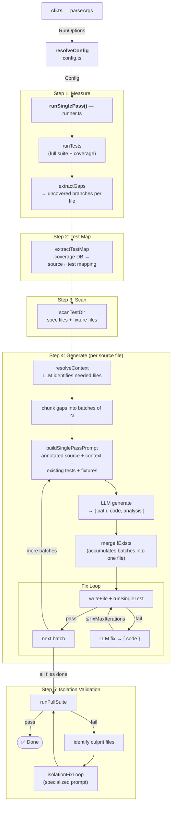

# @azure-tools/test-gen

Coverage-driven test generation tool for Azure SDK packages. Measures branch
coverage once, then generates targeted tests for all uncovered branches in a
single pass — producing one test file per source module.

## How It Works

The tool uses a **single-pass architecture**: measure once → generate all → verify.

### Step 1: Measure Coverage

Run the full test suite with branch coverage enabled. Parse the coverage data
to identify all uncovered branches, grouped by source file.

### Step 2: Build Test Map

Query the coverage database (`.coverage` SQLite DB or Istanbul JSON) to discover
which existing test files exercise which source files. The top existing test file
is included in the prompt so the LLM can study patterns, fixtures, and assertion
style.

### Step 3: Resolve Context

For each source file with gaps, an LLM call identifies which other project files
are needed to understand the code (imports, types, schemas). These are included
in the generation prompt alongside fixture files (e.g., `conftest.py`).

### Step 4: Generate Tests

Uncovered branches are batched (default: 5 per LLM call). Each batch produces
tests targeting specific `⚠️ UNCOVERED BRANCH` markers in the annotated source.
All batches for the same source file merge into a single output file named after
the source module (e.g., `__init__.py` → `test_init_gaps.py`).

### Step 5: Fix Loop

Each generated file is written to disk and run. If tests fail, the errors are
sent back to the LLM for correction (up to `fixMaxIterations` attempts).

### Step 6: Full-Suite Isolation Validation

After all files are generated, the full test suite runs to detect cross-test
isolation issues (e.g., global state pollution). If failures are found, the
culprit file is identified by temporary removal and sent through a specialized
isolation fix loop.

The system never modifies existing test files. Generated tests go into new
`test_<module>_gaps.<ext>` files.

## Quick Start

```bash
# From the repo root:

# 1. Build the target package
pnpm turbo build --filter=@azure/core-util... --token 1

# 2. Run the coverage-driven generation loop
node common/tools/test-gen/launch.js sdk/core/core-util

# 3. Dry-run: print generated tests to console without writing to disk
node common/tools/test-gen/launch.js sdk/core/core-util --dry-run
```

> Packages that list `@azure-tools/test-gen` as a devDependency get a `test-gen`
> binary in their `node_modules/.bin/` and can use `npx test-gen <dir>` instead.

### Programmatic API (Single-Pass)

```typescript
import { runSinglePass } from "@azure-tools/test-gen";

const result = await runSinglePass({
  packageDir: "/path/to/package",
  config: {
    runner: {
      command: "pytest tests/ --cov=mypackage --cov-branch --cov-report=json:coverage.json",
      coveragePath: "coverage.json",
      coverageFormat: "coveragepy",
      runSingle: "pytest $FILE -x -q",
      coverageDbPath: ".coverage",
    },
    paths: {
      testDir: "tests",
      sourcePrefix: "mypackage/",
      specExclusions: ["__pycache__", "conftest", "live"],
    },
    language: { testFramework: "pytest", outputExtension: ".py" },
    loop: { gapBatchSize: 5, maxGapFiles: 10, fixMaxIterations: 3 },
    llm: { model: "gpt-5.3-codex", fixModel: "gpt-5.3-codex" },
  },
  onProgress: console.log,
});

console.log(`Coverage: ${result.initialBranchCoverage}% → ${result.finalBranchCoverage}%`);
console.log(`Generated: ${result.generatedFiles.length} files, ${result.llmCalls} LLM calls`);
```

## CLI Usage

```
test-gen <package-dir> [options]
```

| Option | Description | Default |
|---|---|---|
| `--model <name>` | LLM model name | `gpt-5.3-codex` |
| `--dry-run` | Print generated tests to console without writing to disk | `false` |
| `--help` | Show help | |

Ctrl+C (SIGINT) gracefully aborts after the current iteration.

## Configuration

All behavior is controlled through a centralized `Config` object. The CLI maps
flags to config overrides; programmatic callers pass a partial config to
`runSinglePass()`. Every field has a default — only override what
you need.

```typescript
interface Config {
  runner: RunnerConfig;
  paths: PathsConfig;
  llm: LlmConfig;
  loop: LoopConfig;
  examples: ExamplesConfig;
  language: LanguageConfig;
}
```

### `runner` — Test execution

| Field | Type | Default | Description |
|---|---|---|---|
| `command` | `string` | `"npm run test:node"` | Shell command to run full test suite with coverage |
| `coveragePath` | `string` | `"coverage/coverage-final.json"` | Coverage JSON path (relative to packageDir) |
| `coverageFormat` | `string` | `"istanbul"` | Coverage data format: `"istanbul"` or `"coveragepy"` |
| `runSingle` | `string` | `"npm run test:node -- $FILE"` | Command to run a single test file (`$FILE` is replaced) |
| `coverageDbPath` | `string` | — | Path to `.coverage` SQLite DB for test map extraction |
| `timeout` | `number` | `120000` | Test execution timeout in ms |
| `maxBuffer` | `number` | `10485760` | Max stdout buffer in bytes (10 MB) |
| `tailLines` | `number` | `20` | Trailing stdout lines to display after a test run |

### `paths` — Directory and file conventions

| Field | Type | Default | Description |
|---|---|---|---|
| `testDir` | `string` | `"test"` | Test directory relative to packageDir |
| `sourcePrefix` | `string` | `"src/"` | Prefix to filter coverage entries to source files |
| `sourceExclusions` | `string[]` | `[]` | Substrings to exclude from source file discovery |
| `testExtensions` | `string[]` | `[".ts", ".js"]` | File extensions when scanning the test directory |
| `specSuffix` | `string` | `".spec.ts"` | Suffix identifying spec files for example picking |
| `specExclusions` | `string[]` | `["snippets", "node_modules"]` | Substrings to exclude from spec discovery |

### `llm` — LLM interaction

| Field | Type | Default | Description |
|---|---|---|---|
| `model` | `string` | `"gpt-5.3-codex"` | Model name for generation and context resolution |
| `fixModel` | `string` | — | Model name for fix loops (falls back to `model`) |

### `loop` — Loop parameters

| Field | Type | Default | Description |
|---|---|---|---|
| `fixMaxIterations` | `number` | `3` | Maximum fix attempts per generated test file |
| `gapBatchSize` | `number` | `5` | Uncovered branches per LLM generation call |
| `maxGapFiles` | `number` | `20` | Maximum source files to process |

### `examples` — Prompt building

| Field | Type | Default | Description |
|---|---|---|---|
| `maxLines` | `number` | `80` | Max lines to show from each example test file |
| `count` | `number` | `2` | Number of example test files to include in the prompt |

### `language` — Language-specific settings

Override these when targeting a non-JS/TS codebase. The code-fence language tag
for LLM prompts is derived automatically from `outputExtension`.

| Field | Type | Default | Description |
|---|---|---|---|
| `testFramework` | `string` | `"vitest"` | Test framework name used in prompts |
| `outputExtension` | `string` | `".ts"` | File extension for generated test output |

## Dataflow



**LLM calls per source file**

1. **resolveContext** — identifies which project files to include as context
2–N. **generate** `{ path, code, analysis }` — one call per batch of uncovered branches
N+1. **merge** `{ code }` — when a second batch targets the same output file *(conditional)*
N+2. **fix** `{ code }` — current code + test errors *(only on failure)*

**Data sources**

| Source | Reader | Produces |
|---|---|---|
| `coverage.json` | `extractGaps` | branch-level gaps per source file |
| `.coverage` SQLite DB | `extractTestMap` | source file → existing test file mapping |
| test directory | `scanTestDir` | spec files, fixture files, folder tree |
| source files | `annotateSource` | source with `⚠️ UNCOVERED BRANCH` markers |

## Architecture

```
src/
├── cli.ts                    # CLI entry point (parseArgs + SIGINT handler)
├── config.ts                 # Config schema, defaults, resolveConfig()
├── runner.ts                 # runSinglePass(), merge, writeAndFix,
│                             # isolationFixLoop(), runFullSuite()
├── build-prompt.ts           # Prompt assembler (annotated source + context)
├── extract-gaps.ts           # Coverage parser (Istanbul + coverage.py)
├── extract-test-map.ts       # .coverage SQLite DB → source↔test mapping
├── extract-conventions.ts    # Test file pattern scanner
├── resolve-context.ts        # LLM-driven context file identification
├── annotate-source.ts        # Inline ⚠️ marker injection for uncovered branches
├── llm.ts                    # Singleton CopilotClient, send()
├── node-sqlite.d.ts          # Type declarations for node:sqlite (Node 22+)
├── utils.ts                  # fileExists, tryReadFile, numberLines
├── types.ts                  # Shared types (Pos, CoverageGap, RunReport, etc.)
├── index.ts                  # Public API barrel export
└── loop/
    ├── loop.ts               # Loop<T> + loop() — generic terminal loop
    └── index.ts              # Barrel re-exports
```

## Prerequisites

- The target package must produce a coverage JSON file in one of the supported
  formats: Istanbul (`coverage-final.json`) or coverage.py (`coverage json`).
  Set `runner.coverageFormat` accordingly.
- For test map extraction (recommended): a `.coverage` SQLite DB produced by
  `pytest --cov-context=test`. Set `runner.coverageDbPath`.
- GitHub Copilot must be authenticated (`gh auth login` or `GITHUB_TOKEN`).
- Node.js 22+ (required for `node:sqlite`) and pnpm.
