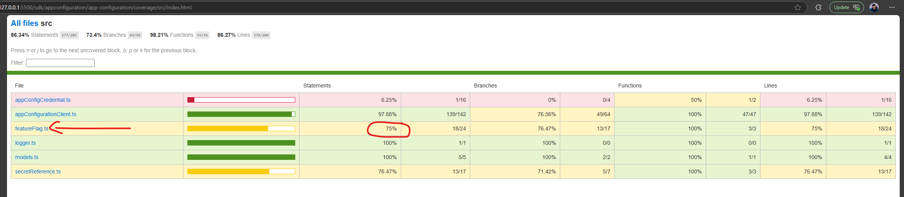
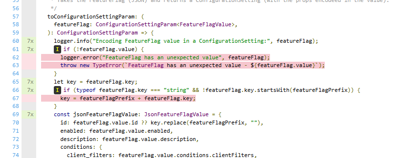
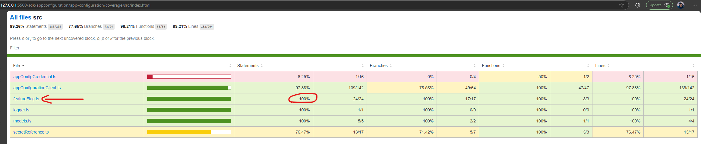
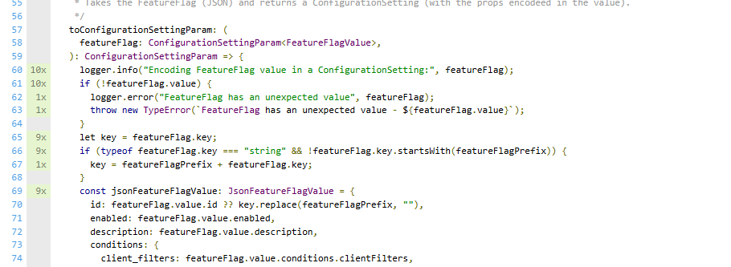
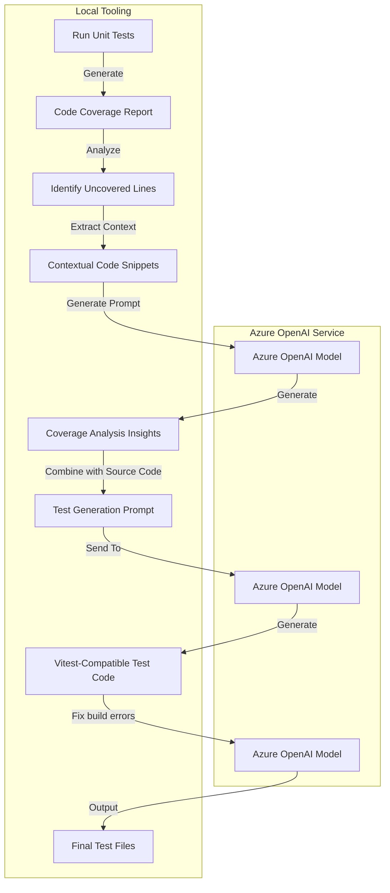

# Test Generation from Uncovered Lines of Code Coverage

## Introduction

This tool focuses on generating unit tests specifically for **uncovered lines of code** identified from test coverage reports. By leveraging Azure OpenAI, it creates precise tests to address these gaps, ensuring improved code coverage and quality. Additionally, it automates the resolution of common build errors, saving developers time and effort.

---
## Project Goals

- **Automate Test Generation**: Automatically generate tests targeting uncovered lines of code, reducing manual effort.
- **Improve Code Coverage**: Systematically identify uncovered lines and ensure they are tested.
- **Enhance Code Quality**: Automatically detect and fix build errors in generated tests, ensuring maintainable test code.
- **Accelerate Development**: Allow developers to focus on feature development rather than manually addressing/testing uncovered code paths.

---

## Current Scope and Capabilities

The current implementation includes:

1. **Coverage Analysis**:
   - Parses coverage reports to pinpoint uncovered lines of code.
   - Extracts contextual code snippets around these uncovered lines for meaningful insights.

2. **AI-Driven Test Scenario Generation**:
   - Uses Azure OpenAI models to analyze uncovered lines and suggest targeted test scenarios, edge cases, and error conditions.
   - Generates detailed prompts based on uncovered lines and their surrounding context.

3. **Automated Test Code Generation**:
   - Generates complete Vitest-compatible TypeScript test files specifically addressing uncovered lines using Azure OpenAI models based on the insights from the previous step.

4. **Automated Build Error Resolution**:
   - Resolves TypeScript build errors in tests generated for uncovered lines by doing multiple iterations of building and fixing the build errors.

## Example

- Test file generated for `@azure/app-configuration` based on the uncovered lines from code coverage.
    
    Link to file - https://github.com/Azure/azure-sdk-for-js/blob/70adbc5a89a8b249bd71bf04e7fc120f3d5cbe60/sdk/appconfiguration/app-configuration/test/public/generated-featureFlag.spec.ts
- Before
  
  Example uncovered lines in red:
  
- After
  
  Full coverage now:
  

---

### Workflow/Architecture

---

## Benefits and Impact

1. **Maintainability**:
   - Enables confident refactoring with comprehensive test coverage.   
   - **Risk Mitigation**: Prevents regressions by ensuring changes don’t break functionality.
   - Acts as living documentation, clarifying code behavior for future development.

2. **Productivity**:
   - Automates repetitive tasks and reduces rework.
   - Frees developers to focus on new features.

3. **Code Quality**:
   - Detects bugs early and ensures reliable, maintainable code.
   - Simplifies debugging and reduces manual testing effort.

---

## Future Enhancements

- **Multi-file & Multi-package Support**: Extend the tool to handle multiple files and packages simultaneously, improving scalability.
- **Expanding to Other Languages**: Adapt the tool to support additional languages beyond TypeScript, broadening its applicability.
- **CI/CD Integration**: Integrate seamlessly into our CI workflows.
- **Customizable AI Prompts and Models**: Allow customization of AI prompts and model parameters to better suit specific project needs and coding standards.

---
