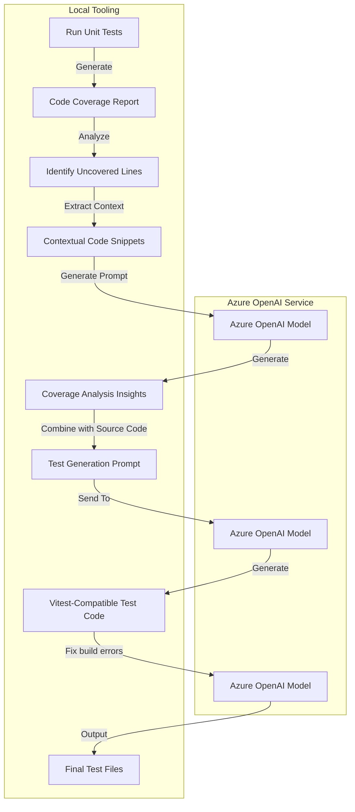

# Test Generator AI Tool - Project Overview and Proposal

## Introduction

The Test Generator AI Tool automates unit test creation for TypeScript projects using AI. It specifically targets **uncovered lines of code identified from test coverage reports**, leveraging Azure OpenAI to generate precise tests for these gaps.

---

## Project Goals

- **Automate Test Generation**: Automatically generate tests targeting uncovered lines of code, reducing manual effort.
- **Improve Code Coverage**: Systematically identify uncovered lines and ensure they are tested.
- **Enhance Code Quality**: Automatically detect and fix build errors in generated tests, ensuring maintainable test code.
- **Accelerate Development**: Allow developers to focus on feature development rather than manually addressing/testing uncovered code paths.

---

## Current Scope and Capabilities

The current implementation includes:

1. **Coverage Analysis**:
   - Parses coverage reports to pinpoint uncovered lines of code.
   - Extracts contextual code snippets around these uncovered lines for meaningful insights.

2. **AI-Driven Test Scenario Generation**:
   - Uses Azure OpenAI models to analyze uncovered lines and suggest targeted test scenarios, edge cases, and error conditions.
   - Generates detailed prompts based on uncovered lines and their surrounding context.

3. **Automated Test Code Generation**:
   - Generates complete Vitest-compatible TypeScript test files specifically addressing uncovered lines using Azure OpenAI models based on the insights from the previous step.

4. **Automated Build Error Resolution**:
   - Resolves TypeScript build errors in tests generated for uncovered lines by doing multiple iterations of building and fixing the build errors.

---

### Workflow/Architecture

---

## Future Enhancements

- **Multi-file & Multi-package Support**: Extend the tool to handle multiple files and packages simultaneously, improving scalability.
- **Expanding to Other Languages**: Adapt the tool to support additional languages beyond TypeScript, broadening its applicability.
- **CI/CD Integration**: Integrate seamlessly into our CI workflows.
- **Customizable AI Prompts and Models**: Allow customization of AI prompts and model parameters to better suit specific project needs and coding standards.

---

## Benefits and Impact

- **Increased Developer Productivity**: Automating repetitive tasks frees developers to focus on high-value feature development.
- **Improved Test Coverage and Quality**: Systematic identification and coverage of uncovered lines lead to more robust software.
- **Reduced Technical Debt**: Automated error fixing and adherence to best practices minimize technical debt accumulation.
- **Scalable Testing Strategy**: Easily scales across multiple projects and teams, ensuring consistent testing standards.

---
