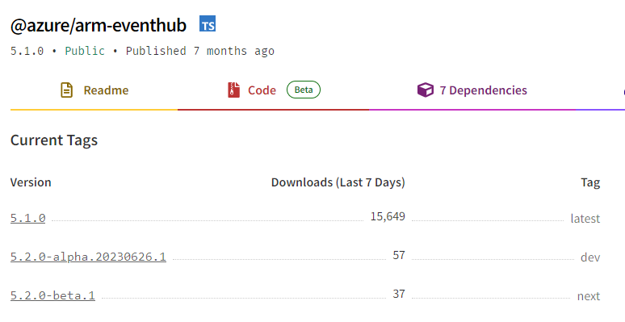

# Shipping Experimental New Features in Modular

## Background

Although we have provide beta release to preview some new service version in our JavaScript SDK, it can still be annoying and potentially diffcult for our customers to try it out. which can be tell from the NPM download data.
  

However, sometimes we want customers to try the preview feature, so that we can get early feedback about those preview features. By providing a separate subpath export for experimental features alongside with the GA release of Modular, we can gather valuable feedback from our customers who have tried these new features while ensuring that our mainline releases remain stable and reliable. And if we have some client-side features that we want our customers to have a try first, we can also put those features under the separate subpath export.

## Key Takeaways

**_Experimental Features_**:  
Experimental features could be either client side features or service preview features or both.  

**_Api version picking strategy_**:  
The api version we choose to generate the experimental code is latest preview, if there's a latest newer GA version, then we will use that GA version when there are some client side features under `beta`.  

**_Client side features_**:  
The client side features should be some innovative ideas or some new proposals which is meant to improve SDK user experience or performance. Features like LRO or Paging are considered as to reach full functionalities. should not be treated as experimental features. it should not happen very often.  

## Proposal

The proposed approach is to add a separate subpath export on top of the existing Azure JavaScript Modular. This introduces a new subpath export `beta`. Such as `@azure/foo/beta`, `@azure/foo/beta/api`, and `@azure/foo/beta/rest`, to isolate the experimental code from the stable code so that we can establish a clear boundary between the stable modules and the experimental features, allowing developers to opt-in and access the experimental functionality while maintaining the integrity of the original Modular structure.

### Proposal with single client

In the case of single-client,

<!-- markdownlint-disable MD033 -->
<table>
  <tr>
    <th>Stable</th>
    <th>Experimental</th>
  </tr>
  <tr>
    <td>
      <pre lang="typescript">
@azure/foo
@azure/foo/api
@azure/foo/rest
@azure/foo/models
</pre>
</td>
<td>
<pre lang="typescript">
@azure/foo/beta
@azure/foo/beta/api
@azure/foo/beta/rest
@azure/foo/beta/models
</pre>
</td>
  </tr>
</table>
<!-- markdownlint-enable MD033 -->

### Proposal with multi-client

<!-- markdownlint-disable MD033 -->
<table>
  <tr>
    <th>Stable</th>
    <th>Experimental</th>
  </tr>
  <tr>
    <td>
      <pre lang="typescript">
@azure/foo
@azure/foo/api
@azure/foo/rest
@azure/foo/models
</pre>
<pre lang="typescript">
@azure/foo/clientA
@azure/foo/clientA/api
@azure/foo/clientA/models
</pre>
<pre lang="typescript">
@azure/foo/clientB
@azure/foo/clientB/api
@azure/foo/clientB/models
</pre>
</td>
<td>
<pre lang="typescript">
@azure/foo/beta
@azure/foo/beta/api
@azure/foo/beta/rest
@azure/foo/beta/models
</pre>
<pre lang="typescript">
@azure/foo/beta/clientA
@azure/foo/beta/clientA/api
@azure/foo/beta/clientA/models
</pre>
<pre lang="typescript">
@azure/foo/beta/clientB
@azure/foo/beta/clientB/api
@azure/foo/beta/clientB/models
</pre>
</td>
  </tr>
</table>
<!-- markdownlint-enable MD033 -->

### Proposal with multi-endpoint

<!-- markdownlint-disable MD033 -->
<table>
  <tr>
    <th>Stable</th>
    <th>Experimental</th>
  </tr>
  <tr>
    <td>
      <pre lang="typescript">
@azure/foo
@azure/foo/api
@azure/foo/models
</pre>
<pre lang="typescript">
@azure/foo/clientA
@azure/foo/clientA/api
@azure/foo/clientA/models
@azure/foo/rest/clientA
</pre>
<pre lang="typescript">
@azure/foo/clientB
@azure/foo/clientB/api
@azure/foo/clientB/models
@azure/foo/rest/clientB
</pre>
</td>
<td>
<pre lang="typescript">
@azure/foo/beta
@azure/foo/beta/api
@azure/foo/beta/models
</pre>
<pre lang="typescript">
@azure/foo/beta/clientA
@azure/foo/beta/clientA/api
@azure/foo/beta/clientA/models
@azure/foo/beta/rest/clientA
</pre>
<pre lang="typescript">
@azure/foo/beta/clientB
@azure/foo/beta/clientB/api
@azure/foo/beta/clientB/models
@azure/foo/beta/rest/clientA
</pre>
</td>
  </tr>
</table>
<!-- markdownlint-enable MD033 -->

## SDK version policies  

1. Bump minor stable version with `/beta` subpath export if preview any service side/client side breaking/non-breaking features.
1. Release a beta package that reflects the code changes before GA the preview features.
1. Release a major beta version if we are previewing any service-side/client-side breaking features to prepare for the GA.
1. If we are planning to GA only service side features that include breaking changes from both service side and client side and client side features have not ready for GA yet, we will release a major version beta package with `/beta` subpath export where the preview service version is in the stable code and client-side feature is in the `/beta` subpath export.
1. If we are planning to GA only client side features that include breaking changes from both service side and client side and service side features have not ready for GA yet, we will release a major beta version with `/beta` subpath export where the stable service version with client side feature is in the stable code and preview service version with client side feature is in the `/beta` subpath export.

## Lifecycle of `beta` SubPath Export

Basically, the `beta` subpath exists when we want to use stable version SDK with `beta` to get more publicity to our experimental features. and it disappears once we have prepared for the GA. if we have both service side features and client side features under the `beta` subpath, it will only get removed when both of them are GA.  

It is important to note that the lifecycle of experimental features on the service API side depends entirely on the service team. However, scenarios where a service feature remains in preview for an extended period without any official announcements regarding its GA status or deprecation are worth to think about.

For experimental features on client side new features, it depends on how complex we want to design it.

## Client-Side Experimental Features Considerations

1. **Experimental Features Frequency**:  
  How common will the client-side experimental features happen will have impact on how complex we want to design it in the codegen side. The current design intention is that client side features should not be a common event.

1. **Changes to Code Structure**:  
  It's important to note that some features may require code structure change compared with the non-experimental code. For instance, in the context of the previous track2 SDK, Modular itself can be considered an experimental feature. This implies that within the same packages, the stable code and experimental code may provide very different code structures or user experience.

1. **Impact on Common Dependencies**:  
  It's very likely that experimental features can rely on newer common dependencies used by the stable code. If such case happens, we should use one latest version of the common dependencies as much as possible. If it turns out we can not use one common version dependencies, we could leverage the following configuration.

   ```json
   "dependencies": {
      "@azure-rest/core-client-v1": "npm:@azure-rest/core-client@^1.0.0",
      "@azure-rest/core-client-v2": "npm:@azure-rest/core-client@^2.0.0"
    } 
   ```

## Conclusion

In conclusion, this design review shows how to ship experimental features with subpath export in Modular, so that we could have better publicity to our customers for those feature we want to gather valuable customer feedbacks from the earlier stage.
