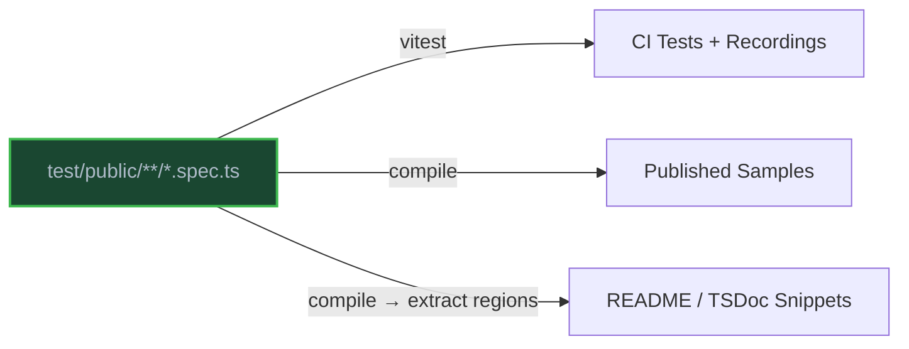

# Unified Sample-Tests

## The Problem

The repo has three content systems that overlap:

| What | Where | Type-checked? | Runs? | Records? |
|---|---|---|---|---|
| Samples | `samples-dev/*.ts` | Yes (PR) | Live only | No |
| Snippets | `test/snippets.spec.ts` | Yes (build) | No (excluded from vitest) | No |
| Tests | `test/**/*.spec.ts` | Yes | Yes | Yes |

Samples run live but have no recorder, so no playback. Snippets drift because nothing connects them to the code they describe. The same scenario often appears in all three places, written separately.

This design replaces all three with one thing: you write tests, and a compiler produces publishable samples and doc snippets from them.



## Author Contract

Three rules:

1. **Each `it` block in a `@summary`-tagged file becomes a named function. The compiler generates `main()` to call them in order.** Add a `@summary` JSDoc tag at the top of the file, before imports. No `@summary` means the compiler skips it.

2. **Use `forPublishing()` to swap test values for published values.** At runtime, `forPublishing(testVal, () => sampleVal)` returns `testVal`. The compiler uses `sampleVal` in the output.

3. **Use `// @snippet Name` / `// @snippet-end Name` to mark regions within samples for docs.** Snippets are parts of samples, not standalone. They highlight specific operations (client creation, a single API call) within a larger runnable sample. The `update-snippets` command extracts these regions from source test files and rewrites imports. Reference them with `` ```ts snippet:Name ``.

The compiler handles everything else: imports, recorder setup, assertions. It classifies imports, removes test infrastructure, and cleans up dead bindings. Files must live under `test/public/` and `forPublishing()` only accepts expression-bodied arrows (`() => expr`). Nested `describe` blocks are not supported. `it.skip` and `it.only` compile normally since those modifiers only matter for the test runner.

## Authoring Guide

### Discovery

The compiler looks for `test/public/samples/*.spec.ts` files that have a `@summary` JSDoc tag before imports. Files under `test/internal/` or other `test/` subdirectories are regular tests and never compile to samples. Each spec file compiles to a flat output file: `test/public/samples/helloWorld.spec.ts` becomes `samples/v4/typescript/src/helloWorld.ts`.

### Minimal Sample-Test

The simplest sample-test: one client call, one assertion:

```typescript
/** @summary say hello to the service */
import { GreeterClient } from "../src/index.js";
// Load the .env file if it exists
import "dotenv/config";
import { describe, it } from "vitest";

describe("hello", () => {
  it("say hello", async () => {
    const client = new GreeterClient(process.env.ENDPOINT || "<your-endpoint>");
    const result = await client.sayHello("world");
    console.log(result.message);
  });
});
```

The compiler rewrites `"../src/index.js"` to the package name, drops `vitest` and the `describe`/`it` wrapper, and generates `main()`. Since there's a single `it`, the body is inlined directly into `main()`. Comments above imports are preserved:

```typescript
import { GreeterClient } from "@azure/greeter";
// Load the .env file if it exists
import "dotenv/config";

export async function main(): Promise<void> {
  const client = new GreeterClient(process.env.ENDPOINT || "<your-endpoint>");
  const result = await client.sayHello("world");
  console.log(result.message);
}

main().catch((error) => {
  console.error(error);
  process.exit(1);
});
```

When there's a single `it`, the body is inlined directly into `main()` and `let` declarations from `describe` scope are promoted to `const` where possible. Multiple `it` blocks get separate named functions with `main()` calling them in order.

### Adding `forPublishing` for Auth

Tests use `createTestCredential()` for auth. Published samples should show `DefaultAzureCredential`. `forPublishing()` bridges the two:

```typescript
/** @summary list items with real authentication */
import { GreeterClient } from "../src/index.js";
import { DefaultAzureCredential } from "@azure/identity";
import { createTestCredential } from "@azure-tools/test-credential";
import { forPublishing } from "@azure-tools/test-publishing";
// Load the .env file if it exists
import "dotenv/config";
import { describe, it } from "vitest";

describe("listItems", () => {
  it("list items", async () => {
    const credential = forPublishing(createTestCredential(), () => new DefaultAzureCredential());
    const client = new GreeterClient(process.env.ENDPOINT || "<your-endpoint>", credential);
    for await (const item of client.listItems()) {
      console.log(item.name);
    }
  });
});
```

At runtime, `credential` is the test credential. In published output, it becomes `new DefaultAzureCredential()`. The `@azure-tools/*` imports and `forPublishing` wrapper are removed. Since there's a single `it`, the body is inlined into `main()`:

```typescript
import { GreeterClient } from "@azure/greeter";
import { DefaultAzureCredential } from "@azure/identity";
// Load the .env file if it exists
import "dotenv/config";

export async function main(): Promise<void> {
  const credential = new DefaultAzureCredential();
  const client = new GreeterClient(process.env.ENDPOINT || "<your-endpoint>", credential);
  for await (const item of client.listItems()) {
    console.log(item.name);
  }
}

main().catch((error) => {
  console.error(error);
  process.exit(1);
});
```

`forPublishing()` works for any test-vs-published difference, not just credentials. At runtime it returns the first argument. The second callback is **never called** during tests; it only exists for the compiler. Both arguments must be type-compatible. Block-bodied arrows (`() => { ... }`) are a compile error. A `recorder.variable` example:

```typescript
const endpoint = forPublishing(
  assertEnvironmentVariable("ENDPOINT"),
  () => process.env.ENDPOINT || "<your-endpoint>",
);
```

### Adding Snippets

Snippets are regions within a sample, not standalone files. Mark regions inside any `it` block to extract them for your README or TSDoc. Each snippet highlights a specific part of a larger sample (client construction, a single operation, error handling) so that documentation stays focused while the full sample provides runnable context:

```typescript
it("list items", async () => {
  const credential = forPublishing(createTestCredential(), () => new DefaultAzureCredential());

  // @snippet ReadmeSample_CreateClient
  const client = new GreeterClient("https://example.azure.net", credential);
  // @snippet-end ReadmeSample_CreateClient

  // @snippet ReadmeSample_ListItems
  for await (const item of client.listItems()) {
    console.log(item.name);
  }
  // @snippet-end ReadmeSample_ListItems
});
```

Both markers carry the name. Reference them in docs as `` ```ts snippet:ReadmeSample_CreateClient ``. `@ts-preserve-whitespace` works inside snippet regions (it becomes a blank line in the published output).

The `update-snippets` command extracts snippets directly from source test files (not compiled output). It reads `// @snippet` regions from `it` block bodies and performs import rewriting so that `"../src/index.js"` becomes the package name. Since extraction happens on source code, `forPublishing` wrappers are **not** automatically substituted in snippets. The snippet shows whatever code is between the markers. Place your `@snippet` markers around the published-facing code (outside the `forPublishing` wrapper) if you want clean snippets.

In the compiled sample output, `@snippet` markers are extracted and then stripped. The published sample files show clean code without any markers.

### Full-Featured Example

Recorder, `forPublishing`, and snippets together:

```typescript
/**
 * @summary create and manage widgets
 * @azsdk-weight 80
 */

import { WidgetClient } from "../src/index.js";
import { DefaultAzureCredential } from "@azure/identity";
import { createTestCredential } from "@azure-tools/test-credential";
import { Recorder } from "@azure-tools/test-recorder";
import { forPublishing } from "@azure-tools/test-publishing";
// Load the .env file if it exists
import "dotenv/config";
import { describe, it, beforeEach, afterEach, expect } from "vitest";

describe("widget lifecycle", () => {
  let recorder: Recorder;
  let client: WidgetClient;

  beforeEach(async (ctx) => {
    recorder = new Recorder(ctx);
    await recorder.start({});
    client = new WidgetClient(
      forPublishing(assertEnvironmentVariable("ENDPOINT"), () => process.env.ENDPOINT || "<your endpoint>"),
      forPublishing(createTestCredential(), () => new DefaultAzureCredential()),
      forPublishing(recorder.configureClientOptions({}), () => ({})),
    );
  });

  afterEach(async () => {
    await recorder.stop();
  });

  it("create a widget", async () => {
    // @snippet ReadmeSample_CreateWidget
    const widget = await client.create("my-widget");
    console.log(widget.name);
    // @snippet-end ReadmeSample_CreateWidget
    expect(widget.name).toBe("my-widget");
  });

  it("update the widget", async () => {
    await client.update("my-widget", { color: "blue" });
    const updated = await client.get("my-widget");
    console.log(updated.color);
  });

  it("delete the widget", async () => {
    await client.delete("my-widget");
    console.log("Deleted");
  });
});
```

The compiler removes `vitest`, `test-recorder`, `test-credential`, and `test-publishing` imports. It replaces each `forPublishing(...)` with the published value, ignores `afterEach` entirely, and moves the surviving `beforeEach` assignments into `main()` as the first statements. It rewrites `"../src/index.js"` to `"@azure/widgets"`, turns each `it` into a named function, and generates `main()` to call them in order. `describe`-level declarations that survive become module-level. The `expect` call is removed as a dead binding from `vitest`. Comments above imports (like the dotenv comment) are preserved. Snippet markers are extracted for `update-snippets` and then stripped from the final output:

```typescript
// Copyright (c) Microsoft Corporation.
// Licensed under the MIT License.

/**
 * @summary create and manage widgets
 * @azsdk-weight 80
 */

import { WidgetClient } from "@azure/widgets";
import { DefaultAzureCredential } from "@azure/identity";
// Load the .env file if it exists
import "dotenv/config";

let client: WidgetClient;

async function createAWidget() {
  const widget = await client.create("my-widget");
  console.log(widget.name);
}

async function updateTheWidget() {
  await client.update("my-widget", { color: "blue" });
  const updated = await client.get("my-widget");
  console.log(updated.color);
}

async function deleteTheWidget() {
  await client.delete("my-widget");
  console.log("Deleted");
}

export async function main(): Promise<void> {
  client = new WidgetClient(
    process.env.ENDPOINT || "<your endpoint>",
    new DefaultAzureCredential(),
    {},
  );

  await createAWidget();
  await updateTheWidget();
  await deleteTheWidget();
}

main().catch((error) => {
  console.error(error);
  process.exit(1);
});
```

### Metadata Tags

These go in the file-top JSDoc comment, before imports:

- **`@summary`** (required): Short description. Becomes the sample's header comment. This is also what opts a file into compilation.
- **`@azsdk-weight`**: Controls order in the generated README. Higher = first.
- **`@azsdk-skip-javascript`**: Skips this sample in JavaScript output.
- **`@azsdk-ignore`**: Compiles the sample but leaves it out of the README listing.

Same tags that `samples-dev/` uses today.

### Asset and Data Files

JSON files imported with import assertions are classified as data files and kept in the output:

```typescript
import Families from "./Data/Families.json" with { type: "json" };
```

TypeScript output keeps the import. JavaScript output lowers it to `require()`.

For assets you can't import (images, audio, certificates), list them in `extraFiles` in the sample configuration. The publish pipeline copies them and keeps relative paths.

## Configuration

Goes in `package.json` under `"//sampleConfiguration"`:

```jsonc
{
  "//sampleConfiguration": {
    "productName": "Azure Storage Blob",
    "productSlugs": ["azure", "azure-storage"],
    "requiredResources": {
      "Azure Storage Account": "https://learn.microsoft.com/azure/storage/..."
    },
    "extraFiles": {
      "test/assets/audio.wav": ["typescript/src/assets/audio.wav", "javascript/assets/audio.wav"]
    },
    "skip": ["brokenSample.spec.ts"],
    "customSnippets": {
      "prerequisites": "snippets/prerequisites.md"
    },
    "apiRefLink": "https://learn.microsoft.com/javascript/api/@azure/storage-blob",
    "dependencyOverrides": {
      "some-unlisted-dep": "^1.0.0"
    },
    "disableDocsMs": false
  }
}
```

The compiler finds sample-tests automatically, so `sampleSource` and `tsconfig.samples.json` are not needed.

Each field:

- **`productName`**: Service name for the README header.
- **`productSlugs`**: Microsoft docs slugs for README metadata.
- **`requiredResources`**: Resource name to provisioning URL, listed in README prerequisites.
- **`extraFiles`**: Source path to output path(s) for non-importable assets.
- **`dependencyOverrides`**: Extra or pinned dependencies the compiler can't see from imports.
- **`skip`**: Files to compile but leave out of published output and README. Or use `@azsdk-ignore` in the JSDoc to only hide from the README listing.
- **`customSnippets`**: Markdown files included in the generated README.
- **`apiRefLink`**: URL for API reference docs in the README.
- **`disableDocsMs`**: Skip docs.ms publishing for this package.
