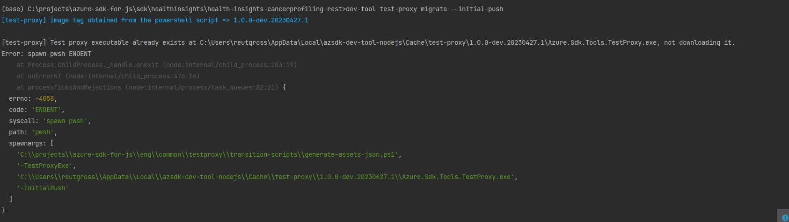
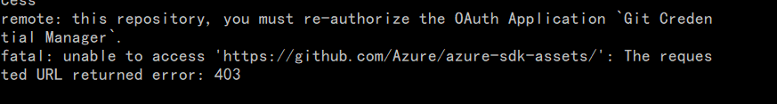

# Overview

This doc shows some common problems and resolution in CI.

# Broken links

Add the broken links into [eng/ignore-links.txt](https://github.com/Azure/azure-sdk-for-js/blob/main/eng/ignore-links.txt) file to bypass this verification or you could update the broken links to valid ones, see [example PR here](https://github.com/Azure/azure-sdk-for-js/pull/23429/commits/1a7b74c4bdad27e423a355a4c7f3dde4ac3c83bc).

# Check spelling (cspell)

For new service the error usually happens, fix spelling in code or in markdown at file [.vscode/cspell.json](https://github.com/Azure/azure-sdk-for-js/blob/main/.vscode/cspell.json). See an example in [devcenter PR](https://github.com/chrissmiller/azure-sdk-for-js/commit/ef18dccae59e98185e3854f8b087230b65735744).

# Push failure\

## Spawn pwsh ENOENT

Install [Powershell](https://github.com/PowerShell/PowerShell). Make sure `pwsh` command works at this step (If you follow the above link, `pwsh` is typically added to the system environment variables by default.)

## Authorization issue

If you are from service team, External to `azure-sdk`, you can follow these steps:
1. To request write access, join an appropriate team from [this list](https://github.com/orgs/Azure/teams?query=azure-sdk-write-)([same list](https://repos.opensource.microsoft.com/teams?q=azure-sdk-write-) on MS OpenSource portal) that corresponds with the product or org that you work in. **Be sure to join only one team.**

2. If you don't see your team in the list? Contact **Scott Kurtzeborn** : <scotk@microsoft.com> to create a new one for your service team.

For more details, join [a partner write team](https://eng.ms/docs/products/azure-developer-experience/onboard/access-teams)

**Note**
For merge permissions to `main` branches, you must be a member of an `azure-sdk-push` team. These permissions are assigned on case-by-case basis only. Reach out to **Scott Kurtzeborn** : <scotk@microsoft.com> if you think that your team needs that permission.
