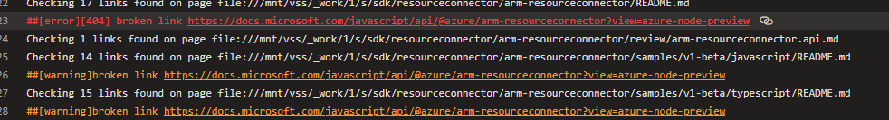

# Overview
This doc shows some common problems and resolution in CI.

# Broken links

Add the broken links into [eng/ignore-links.txt](https://github.com/Azure/azure-sdk-for-js/blob/main/eng/ignore-links.txt) file to bypass this verification or you could update the broken links to valid ones, see [example pr here](https://github.com/Azure/azure-sdk-for-js/pull/23429/commits/1a7b74c4bdad27e423a355a4c7f3dde4ac3c83bc).

## Check spelling (cspell)
For new service the error usually happens, Fix spelling in code or in markdown at file [.vscode/cspell.json](https://github.com/Azure/azure-sdk-for-js/blob/main/.vscode/cspell.json). See an example in [devcenter pr](https://github.com/chrissmiller/azure-sdk-for-js/commit/ef18dccae59e98185e3854f8b087230b65735744).
