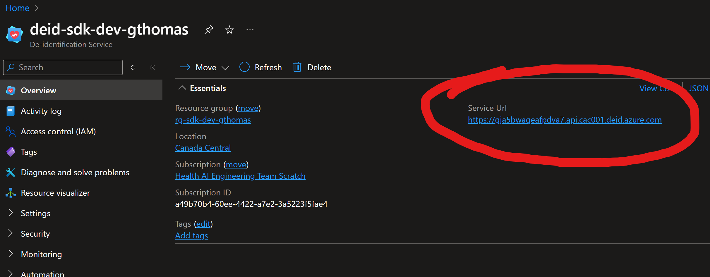

# Azure Deidentification REST client library for JavaScript

`@azure-rest/azure-health-deidentification` is a managed service that enables users to tag, redact, or surrogate health data.

<!-- **Please rely heavily on our [REST client docs](https://github.com/Azure/azure-sdk-for-js/blob/main/documentation/rest-clients.md) to use this library** -->
<!-- TODO Fix links once they are live use placeholden until then -->
Key links:

- [Package (NPM)](https://www.npmjs.com/package/@azure-rest/azure-health-deidentification)
- [API reference documentation](https://www.microsoft.com/en-us/industry/health/microsoft-cloud-for-healthcare)

## Getting started

### Currently supported environments

- LTS versions of Node.js

### Prerequisites

- You must have an [Azure subscription](https://azure.microsoft.com/free/) to use this package.

### Install the `@azure-rest/azure-health-deidentification` package

Install the Azure Deidentification REST client REST client library for JavaScript with `npm`:

```bash
npm install @azure-rest/azure-health-deidentification
```

### Create and authenticate a `DeidentificationClient`

To use an [Azure Active Directory (AAD) token credential](https://github.com/Azure/azure-sdk-for-js/blob/main/sdk/identity/identity/samples/AzureIdentityExamples.md#authenticating-with-a-pre-fetched-access-token),
provide an instance of the desired credential type obtained from the
[@azure/identity](https://github.com/Azure/azure-sdk-for-js/tree/main/sdk/identity/identity#credentials) library.

To authenticate with AAD, you must first `npm` install [`@azure/identity`](https://www.npmjs.com/package/@azure/identity)

After setup, you can choose which type of [credential](https://github.com/Azure/azure-sdk-for-js/tree/main/sdk/identity/identity#credentials) from `@azure/identity` to use.
As an example, [DefaultAzureCredential](https://github.com/Azure/azure-sdk-for-js/tree/main/sdk/identity/identity#defaultazurecredential)
can be used to authenticate the client.

Set the values of the client ID, tenant ID, and client secret of the AAD application as environment variables:
`AZURE_CLIENT_ID`, `AZURE_TENANT_ID`, `AZURE_CLIENT_SECRET`

Pull `ServiceUrl` from your created Deidentification Service.



Basic code snippet to create your Deidentification Client and Deidentify a string.

```javascript
import createClient, {
  DeidentificationContent,
  DeidentificationResultOutput,
} from '@azure-rest/azure-health-deidentification';
import { DefaultAzureCredential } from '@azure/identity';

const credential = new DefaultAzureCredential();
const serviceEndpoint = 'https://example.api.cac001.deid.azure.com';
const client = createClient(serviceEndpoint, credential);
const content: DeidentificationContent = {
  dataType: 'Plaintext',
  inputText: 'Hello John!',
  operation: 'Surrogate',
};

const response = await client.path('/deid').post({ body: content });

console.log((response.body as DeidentificationResultOutput).outputText); // Hello, Tom!

```

## Key concept

Operation Modes:

- Tag: Will return a structure of offset and length with the PHI category of the related text spans.
- Redact: Will return output text with placeholder stubbed text. ex. `[name]`
- Surrogate: Will return output text with synthetic replacements.
  - `My name is John Smith`
  - `My name is Tom Jones`

## Troubleshooting

### Logging

Enabling logging may help uncover useful information about failures. In order to see a log of HTTP requests and responses, set the `AZURE_LOG_LEVEL` environment variable to `info`. Alternatively, logging can be enabled at runtime by calling `setLogLevel` in the `@azure/logger`:

```javascript
const { setLogLevel } = require("@azure/logger");

setLogLevel("info");
```

For more detailed instructions on how to enable logs, you can look at the [@azure/logger package docs](https://github.com/Azure/azure-sdk-for-js/tree/main/sdk/core/logger).
