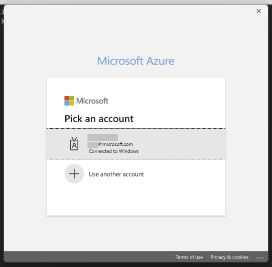
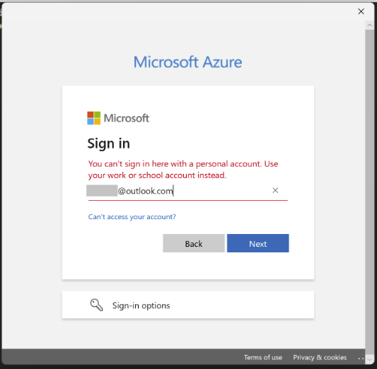
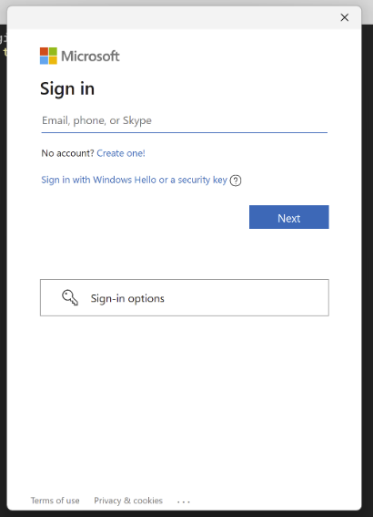

## Troubleshooting Azure Identity Authentication Issues

This troubleshooting guide covers the following areas of the Azure Identity client library for JavaScript/TypeScript:

- Failure investigation techniques
- Common errors for the credential types
- Mitigation steps to resolve errors

## Table of contents

- [Handle Azure Identity errors](#handle-azure-identity-errors)
  - [AggregateAuthenticationError](#aggregateauthenticationerror)
  - [AuthenticationError](#authenticationerror)
  - [AuthenticationRequiredError](#authenticationrequirederror)
  - [CredentialUnavailableError](#credentialunavailableerror)
- [Find relevant information in error messages](#find-relevant-information-in-error-messages)
- [Enable and configure logging](#enable-and-configure-logging)
  - [Allow logging identifiers](#allow-logging-identifiers)
  - [PII logging](#pii-logging)
- [Permission issues](#permission-issues)
- [Troubleshoot default Azure credential authentication issues](#troubleshoot-default-azure-credential-authentication-issues)
- [Troubleshoot environment credential authentication issues](#troubleshoot-environment-credential-authentication-issues)
- [Troubleshoot service principal authentication issues](#troubleshoot-service-principal-authentication-issues)
- [Troubleshoot managed identity authentication issues](#troubleshoot-managed-identity-authentication-issues)
  - [Azure Virtual Machine managed identity](#azure-virtual-machine-managed-identity)
  - [Azure App Service and Azure Functions managed identity](#azure-app-service-and-azure-functions-managed-identity)
  - [Azure Service Fabric managed identity](#azure-service-fabric-managed-identity)
- [Troubleshoot Visual Studio Code authentication issues](#troubleshoot-visual-studio-code-authentication-issues)
- [Troubleshoot Azure CLI authentication issues](#troubleshoot-azure-cli-authentication-issues)
- [Troubleshoot AzureDeveloperCliCredential authentication issues](#troubleshoot-azuredeveloperclicredential-authentication-issues)
- [Troubleshoot Azure PowerShell authentication issues](#troubleshoot-azure-powershell-authentication-issues)
- [Troubleshoot WorkloadIdentityCredential authentication issues](#troubleshoot-workloadidentitycredential-authentication-issues)
- [Troubleshoot AzurePipelinesCredential authentication issues](#troubleshoot-azurepipelinescredential-authentication-issues)
- [Troubleshoot multi-tenant authentication issues](#troubleshoot-multi-tenant-authentication-issues)
- [Troubleshoot Web Account Manager (WAM) and Microsoft account (MSA) login issues](#troubleshoot-web-account-manager-and-microsoft-account-login-issues)

## Handle Azure Identity errors

### AggregateAuthenticationError

An `AggregateAuthenticationError` will be raised by `ChainedTokenCredential` with an `errors` field containing an array of errors from each credential in the chain.

### AuthenticationError

The `AuthenticationError` is used to indicate a failure to authenticate with Microsoft Entra ID. The `errorResponse` field contains more details about the specific failure.

```ts snippet:troubleshooting_authentication_error
import { DefaultAzureCredential } from "@azure/identity";
import { KeyClient } from "@azure/keyvault-keys";

// Create a key client using the DefaultAzureCredential
const keyVaultUrl = "https://key-vault-name.vault.azure.net";
const credential = new DefaultAzureCredential();
const client = new KeyClient(keyVaultUrl, credential);

try {
  // Retrieving the properties of the existing keys in that specific Key Vault.
  console.log(await client.listPropertiesOfKeys().next());
} catch (error) {
  console.log("Microsoft Entra ID service response with error", error);
}
```

### AuthenticationRequiredError

Errors arising from authentication issues can be thrown on any service client method that makes a request to the service. This is because the token is requested from the credential on the first call to the service and on any subsequent call that needs to refresh the token.

To distinguish these failures from failures in the service client, Azure Identity classes throw the `AuthenticationRequiredError`. Details describing the source of the error are provided in the error message. Depending on the application, these errors may or may not be recoverable.

```ts snippet:troubleshooting_authentication_required_error
import { DefaultAzureCredential } from "@azure/identity";
import { KeyClient } from "@azure/keyvault-keys";

// Create a key client using the DefaultAzureCredential
const keyVaultUrl = "https://key-vault-name.vault.azure.net";
const credential = new DefaultAzureCredential();
const client = new KeyClient(keyVaultUrl, credential);

try {
  // Retrieving the properties of the existing keys in that specific Key Vault.
  console.log(await client.listPropertiesOfKeys().next());
} catch (error) {
  console.log("Authentication Failed", error);
}
```

### CredentialUnavailableError

The `CredentialUnavailableError` is used to indicate that the credential can't authenticate in the current environment due to lack of required configuration or setup. This error is also used as a signal to chained credential types, such as `DefaultAzureCredential` and `ChainedTokenCredential`, that the chained credential should continue to try other credential types later in the chain. In `ManagedIdentityCredential`, it can also trigger if the authentication endpoint (like the IMDS endpoint) is unavailable.

## Find relevant information in error messages

`AuthenticationRequiredError` is thrown when unexpected errors occurred while a credential is authenticating. This can include errors received from requests to the Microsoft Entra Security Token Service (STS) and often contains information helpful to diagnosis. Consider the following `AuthenticationRequiredError` message:

` AuthenticationRequiredError: invalid_request: 9002331 - [2022-02-04 00:28:06Z]: AADSTS9002331: Application '6b666991-4567-4982-9981-61877200efy1'(kaghiya-identity) is configured for use by Microsoft Account users only. Please use the /consumers endpoint to serve this request.
Trace ID: 00a7e15c-4557-4974-91d5-886428b00e00
Correlation ID: 20267531-0284-4543-93d7-cf50919fd841
Timestamp: 2022-02-04 00:28:06Z - Correlation ID: 20267531-0284-4543-93d7-cf50919fd841 - Trace ID: 00a7e15c-4557-4974-91d5-886428b00e00`

This error contains several pieces of information:

- **Failing Credential Type**: The type of credential that failed to authenticate. This can be helpful when diagnosing issues with chained credential types, such as `DefaultAzureCredential` or `ChainedTokenCredential`.

- **STS Error Code and Message**: The error code and message returned from the Microsoft Entra STS. This can give insight into the specific reason the request failed. In this specific case, the request failed because the provided client secret is incorrect. For more information, see [Microsoft Entra STS error codes](https://learn.microsoft.com/entra/identity-platform/reference-error-codes#aadsts-error-codes).

- **Correlation ID and Timestamp**: The correlation ID and call timestamp used to identify the request in server-side logs. This information can be useful to support engineers when diagnosing unexpected STS failures.

### Enable and configure logging

The Azure Identity library has the same [logging capabilities](https://github.com/Azure/azure-sdk-for-js/tree/main/sdk/core#logging) as the rest of the Azure SDK.

For help with debugging authentication issues or diagnosing errors in credentials that encompass multiple credentials, like `DefaultAzureCredential`, see [Logging](https://github.com/Azure/azure-sdk-for-js/blob/main/sdk/identity/identity/README.md#logging).

```ts snippet:troubleshooting_logging
import { setLogLevel } from "@azure/logger";

// set up the log level to enable the logger
setLogLevel("info");
```

Alternatively, you can set the `AZURE_LOG_LEVEL` environment variable to `info`. You can read this environment variable from the _.env_ file by explicitly specifying a file path:

```ts snippet:troubleshooting_dotenv
import dotenv from "dotenv";

dotenv.config({ path: ".env" });
```

Consider a scenario in which you have the following environment variables set up either in your environment or _.env_ file:

- `AZURE_TENANT_ID`
- `AZURE_CLIENT_ID`
- `AZURE_CLIENT_SECRET`

You authenticate using `DefaultAzureCredential` and enable logging. You'll see the following logging statements:

```
azure:identity:info EnvironmentCredential => Found the following environment variables: AZURE_TENANT_ID, AZURE_CLIENT_ID, AZURE_CLIENT_SECRET
azure:identity:info EnvironmentCredential => Invoking ClientSecretCredential with tenant ID: [REDACTED], clientId: [REDACTED] and clientSecret: [REDACTED]
```

These logging statements indicate that the `EnvironmentCredential` is being used for authentication and `ClientSecretCredential` is invoked.

> CAUTION: Requests and responses in the Azure Identity library contain sensitive information. Precaution must be taken to protect logs when customizing the output to avoid compromising account security.

#### Allow logging identifiers

In cases where the authentication code might be running in an environment with more than one credential available, the `@azure/identity` package offers a unique form of logging. On the optional parameters for every credential, developers can set `allowLoggingAccountIdentifiers` to `true` in the `loggingOptions` to log information specific to the authenticated account after each successful authentication, including the Client ID, the Tenant ID, the Object ID of the authenticated user, and, if possible, the User Principal Name.

For example, using the `DefaultAzureCredential`:

```ts snippet:troubleshooting_logging_identifiers
import { setLogLevel } from "@azure/logger";
import { DefaultAzureCredential } from "@azure/identity";

setLogLevel("info");

const credential = new DefaultAzureCredential({
  loggingOptions: { allowLoggingAccountIdentifiers: true },
});
```

Once that credential authenticates, the following message will appear in the logs (with the real information instead of `HIDDEN`):

```
azure:identity:info [Authenticated account] Client ID: HIDDEN. Tenant ID: HIDDEN. User Principal Name: HIDDEN. Object ID (user): HIDDEN
```

#### PII logging

In cases where the user's [Personally Identifiable Information](https://github.com/AzureAD/microsoft-authentication-library-for-dotnet/wiki/PII) needs to be logged for customer support, developers can set `enableUnsafeSupportLogging` to `true` in the `loggingOptions`.

For example, using the `DefaultAzureCredential`:

```ts snippet:troubleshooting_pii_logging
import { setLogLevel } from "@azure/logger";
import { DefaultAzureCredential } from "@azure/identity";

setLogLevel("info");

const credential = new DefaultAzureCredential({
  loggingOptions: { enableUnsafeSupportLogging: true },
});
```

## Permission issues

If you're using app registration to authenticate the service, ensure the app registration has the correct permissions and role assignments in the service you want to use. For example, if you want to have access to the Azure App Configuration service through Microsoft Entra ID, ensure your app registration has the permissions and role assignments for access to Microsoft Entra ID. You can either be assigned the role directly or be in a group that's assigned the role. The "Contributor" and the "Owner" roles allow you to manage the App Configuration resource. In this case, you can either use "App Configuration Data Owner" directly on the user or the Microsoft Entra group. Alternatively, use "Owner" on the Microsoft Entra group. While the App Configuration data can be accessed using access keys, these keys don't grant direct access to the data using Microsoft Entra ID.

## Troubleshoot default Azure credential authentication issues

### Credential unavailable

The `DefaultAzureCredential` attempts to retrieve an access token by sequentially invoking a chain of credentials. In this scenario, the `CredentialUnavailableError` signifies that all credentials in the chain failed to retrieve the token in the current environment setup/configuration. You need to follow the configuration instructions for the respective credential you're looking to use via the `DefaultAzureCredential` chain, so that the credential can work in your environment.

| Error                                                                                                                               | Description                                                                                                                                                                                                                                                                                        | Mitigation                                                                                                                                                                                                                                                                                                                                                                                                                                                                                                                                                                                                                                                                                                    |
| ----------------------------------------------------------------------------------------------------------------------------------- | -------------------------------------------------------------------------------------------------------------------------------------------------------------------------------------------------------------------------------------------------------------------------------------------------- | ------------------------------------------------------------------------------------------------------------------------------------------------------------------------------------------------------------------------------------------------------------------------------------------------------------------------------------------------------------------------------------------------------------------------------------------------------------------------------------------------------------------------------------------------------------------------------------------------------------------------------------------------------------------------------------------------------------- |
| `CredentialUnavailableError` thrown with message `DefaultAzureCredential failed to retrieve a token from the included credentials.` | All credentials in the `DefaultAzureCredential` chain failed to retrieve a token, each throwing a `CredentialUnavailableError` themselves.                                                                                                                                                         | <ul><li>[Enable logging](#enable-and-configure-logging) to verify the credentials being tried, and get further diagnostic information.</li><li>Consult the troubleshooting guide for underlying credential types for more information.</li><ul><li>[EnvironmentCredential](#troubleshoot-environment-credential-authentication-issues)</li><li>[ManagedIdentityCredential](#troubleshoot-managed-identity-authentication-issues)</li><li>[VisualStudioCodeCredential](#troubleshoot-visual-studio-code-authentication-issues)</li><li>[AzureCliCredential](#troubleshoot-azure-cli-authentication-issues)</li><li>[AzurePowerShellCredential](#troubleshoot-azure-powershell-authentication-issues)</li></ul> |
| `RestError` raised from the client with a status code of 401 or 403.                                                                | Authentication succeeded but the authorizing Azure service responded with a 401 (Authenticate), or 403 (Forbidden) status code. This can often be caused by the `DefaultAzureCredential` authenticating an account other than the intended or that the required role assignment is not configured. | <ul><li>[Enable logging](#enable-and-configure-logging) to determine which credential in the chain returned the authenticating token.</li><li>In the case a credential other than the expected is returning a token, you may bypass this by signing out of the corresponding development tool.</li><li>Confirm that the correct RBAC role is assigned to the identity being used to authenticate. For example, the resource-specific role, rather than just the inherited "Owner" role.</li></ul>                                                                                                                                                                                                             |
|Invalid value for AZURE_TOKEN_CREDENTIALS = "...". |AZURE_TOKEN_CREDENTIALS has an unexpected value| Specify a valid value as described in DefaultAzureCredential documentation. Valid values are 'prod' or 'dev' or any of these credentials - "EnvironmentCredential" or "ManagedIdentityCredential or "WorkloadIdentityCredential" or "VisualStudioCodeCredential" or "AzureCliCredential" or "AzureDeveloperCliCredential" or "AzurePowershellCredential".|
| Required environment variable (/variables) "..., ..." for `DefaultAzureCredential` is (/are) not set or empty. | One or more environment variable names provided with the `requiredEnvVars` option are not set or contain empty values. | Set the specified environment variable(s) to valid credential configuration values via `options.requiredEnvVars` before starting the application. The union type `DefaultAzureCredentialVars` contains the supported environment variables for `DefaultAzureCredential`.  |

> 📢 The Azure Identity library for JavaScript does _not_ support the `ExcludeXXXCredential` properties that exist for languages like .NET and Python. We recommend creating a custom [ChainedTokenCredential](https://github.com/Azure/azure-sdk-for-js/blob/f0ac28977d26172f79e5c5100148e7f767f4dbf9/sdk/identity/identity/README.md#define-a-custom-authentication-flow-with-the-chainedtokencredential) if you require a different set or ordering of credentials than those offered by `DefaultAzureCredential`.

## Troubleshoot environment credential authentication issues

### CredentialUnavailableError

| Error Message                                  | Description                                              | Mitigation                                                                                                                                                                                                                                                                                                                                                                                                                                                                                                                                                                                                                                                                           |
| ---------------------------------------------- | -------------------------------------------------------- | ------------------------------------------------------------------------------------------------------------------------------------------------------------------------------------------------------------------------------------------------------------------------------------------------------------------------------------------------------------------------------------------------------------------------------------------------------------------------------------------------------------------------------------------------------------------------------------------------------------------------------------------------------------------------------------ |
| Environment variables aren't fully configured. | A valid combination of environment variables wasn't set. | Ensure the appropriate environment variables are set **prior to application startup** for the intended authentication method.<p/> <ul><li>To authenticate a service principal using a client secret, ensure the variables `AZURE_CLIENT_ID`, `AZURE_TENANT_ID`, and `AZURE_CLIENT_SECRET` are properly set.</li><li>To authenticate a service principal using a certificate, ensure the variables `AZURE_CLIENT_ID`, `AZURE_TENANT_ID`, `AZURE_CLIENT_CERTIFICATE_PATH`, and optionally `AZURE_CLIENT_CERTIFICATE_PASSWORD` are properly set.</li><li>To authenticate a user using a password, ensure the variables `AZURE_USERNAME` and `AZURE_PASSWORD` are properly set.</li><ul> |

### Client authentication error

The `EnvironmentCredential` supports service principal authentication.
Follow the troubleshooting guidelines below for the authentication type that failed.

| Authentication Type                            | Troubleshooting Guide                                                                 |
| ---------------------------------------------- | ------------------------------------------------------------------------------------- |
| ClientSecret/ClientCertificate/ClientAssertion | [Service principal auth guide](#troubleshoot-service-principal-authentication-issues) |

## Troubleshoot service principal authentication issues

### Invalid argument issues

#### Client Id

The Client ID is the app ID of the registered app / service principal in Microsoft Entra ID. It's a required parameter for `ClientSecretCredential`, `ClientCertificateCredential`, and `ClientAssertionCredential`. If you've already created your service principal, you can retrieve the client/app ID by following the instructions [here](https://learn.microsoft.com/entra/identity-platform/howto-create-service-principal-portal#get-tenant-and-app-id-values-for-signing-in).

#### Tenant Id

The tenant ID is the Global Unique Identifier (GUID) that identifies your organization. It's a required parameter for `ClientSecretCredential`, `ClientCertificateCredential` and `ClientAssertionCredential`. If you've already created your service principal, you can retrieve the client/app ID by following the instructions [here](https://learn.microsoft.com/entra/identity-platform/howto-create-service-principal-portal#get-tenant-and-app-id-values-for-signing-in).

| Error Code                   | Description                                                                                                                                                                                                                                                | Mitigation                                                                                                                                                                                                                                                                                                                                                                                              |
| ---------------------------- | ---------------------------------------------------------------------------------------------------------------------------------------------------------------------------------------------------------------------------------------------------------- | ------------------------------------------------------------------------------------------------------------------------------------------------------------------------------------------------------------------------------------------------------------------------------------------------------------------------------------------------------------------------------------------------------- |
| `endpoints_resolution_error` | Could not resolve endpoints. Please check network and try again. Detail: ClientAuthError: openid_config_error: Could not retrieve endpoints. Check your authority and verify the .well-known/openid-configuration endpoint returns the required endpoints. | Ensure the specified `tenantId` is correct for your application registration. For multi-tenant apps, ensure the application has been added to the desired tenant by a tenant admin. To add a new application in the desired tenant, follow the instructions [here](https://learn.microsoft.com/entra/identity-platform/howto-create-service-principal-portal#option-2-create-a-new-application-secret). |

### Client secret credential issues

#### AuthenticationRequiredError

| Error Code    | Description                                                     | Mitigation                                                                                                                                                                                                                                                                                                                                                                                                              |
| ------------- | --------------------------------------------------------------- | ----------------------------------------------------------------------------------------------------------------------------------------------------------------------------------------------------------------------------------------------------------------------------------------------------------------------------------------------------------------------------------------------------------------------- |
| AADSTS7000215 | An invalid client secret was provided.                          | Ensure the `clientSecret` provided when constructing the credential is valid. If unsure, create a new client secret using the Azure portal. Details on creating a new client secret can be found [here](https://learn.microsoft.com/entra/identity-platform/howto-create-service-principal-portal#option-2-create-a-new-application-secret).                                                                            |
| AADSTS7000222 | An expired client secret was provided.                          | Create a new client secret using the Azure portal. Details on creating a new client secret can be found [here](https://learn.microsoft.com/entra/identity-platform/howto-create-service-principal-portal#option-2-create-a-new-application-secret).                                                                                                                                                                     |
| AADSTS700016  | The specified application wasn't found in the specified tenant. | Ensure the specified `clientId` and `tenantId` are correct for your application registration. For multi-tenant apps, ensure the application has been added to the desired tenant by a tenant admin. To add a new application in the desired tenant, follow the instructions [here](https://learn.microsoft.com/entra/identity-platform/howto-create-service-principal-portal#option-2-create-a-new-application-secret). |

### Client certificate credential issues

#### AuthenticationRequiredError

| Error Code   | Description                                                     | Mitigation                                                                                                                                                                                                                                                                                                                                                                                                                                            |
| ------------ | --------------------------------------------------------------- | ----------------------------------------------------------------------------------------------------------------------------------------------------------------------------------------------------------------------------------------------------------------------------------------------------------------------------------------------------------------------------------------------------------------------------------------------------- |
| AADSTS700016 | The specified application wasn't found in the specified tenant. | Ensure the specified `clientId` and `tenantId` are correct for your application registration. For multi-tenant apps, ensure the application has been added to the desired tenant by a tenant admin. To add a new application in the desired tenant, follow the instructions [here](https://learn.microsoft.com/azure/developer/javascript/how-to/with-sdk/set-up-development-environment?tabs=azure-sdk-for-javascript#1-create-a-service-principal). |

#### Client certificate argument

These errors will be thrown by the JS Identity SDK and thus will have no error codes from the service.

| Error Code    | Description                                                                                                                                                                                                                           | Mitigation                                                                                                                                                                                                                                                                                                                                                                                                                                                                                           |
| ------------- | ------------------------------------------------------------------------------------------------------------------------------------------------------------------------------------------------------------------------------------- | ---------------------------------------------------------------------------------------------------------------------------------------------------------------------------------------------------------------------------------------------------------------------------------------------------------------------------------------------------------------------------------------------------------------------------------------------------------------------------------------------------- |
| No error code | ClientCertificateCredential: Provide either a PEM certificate in string form, or the path to that certificate in the filesystem. To troubleshoot, visit https://aka.ms/azsdk/js/identity/serviceprincipalauthentication/troubleshoot. | The `ClientCertificateCredential` accepts PEM certificates and the path for the certificate needs to be provided(`pfx` certificates aren't supported by the JavaScript library for now). The certificate needs to be associated with your registered app/service principal. To create and associate a certificate with your registered app, follow the instructions [here](https://learn.microsoft.com/entra/identity-platform/howto-create-service-principal-portal#option-1-upload-a-certificate). |
| No error code | The file at the specified path doesn't contain a PEM-encoded certificate.                                                                                                                                                             | Provide only PEM certificates for `ClientCertificateCredential`. `pfx` certificates aren't supported by the JavaScript library for now. Additionally, ensure that the certificate at the path specified by `AZURE_CLIENT_CERTIFICATE_PATH` contains both the private key and the certificate. See example formats in our test assets: [fake-cert.pem](https://github.com/Azure/azure-sdk-for-js/blob/main/sdk/identity/identity/assets/fake-cert.pem) and [fake-cert-password.pem](https://github.com/Azure/azure-sdk-for-js/blob/main/sdk/identity/identity/assets/fake-cert-password.pem). |

### Client assertion credential issues

#### AuthenticationRequiredError

| Error Code   | Description                                                                                                                                                                          | Mitigation                                                                                                                                                                                                                                                                                                    |
| ------------ | ------------------------------------------------------------------------------------------------------------------------------------------------------------------------------------ | ------------------------------------------------------------------------------------------------------------------------------------------------------------------------------------------------------------------------------------------------------------------------------------------------------------- |
| AADSTS700021 | Client assertion application identifier doesn't match 'client_id' parameter. Review the documentation at https://learn.microsoft.com/entra/identity-platform/certificate-credentials | Ensure the JWT assertion created has the correct values specified for the `sub` and `issuer` value of the payload, both of these should have the value be equal to `clientId`. Refer documentation for [client assertion format](https://learn.microsoft.com/entra/identity-platform/certificate-credentials) |
| AADSTS700023 | Client assertion audience claim does not match Realm issuer. Review the documentation at https://learn.microsoft.com/entra/identity-platform/certificate-credentials.                | Ensure the audience `aud` field in the JWT assertion created has the correct value for the audience specified in the payload. This should be set to `https://login.microsoftonline.com/{tenantId}/v2`.                                                                                                        |
| AADSTS50027  | JWT token is invalid or malformed.                                                                                                                                                   | Ensure the JWT assertion token is in the valid format. Refer to the documentation for [client assertion format](https://learn.microsoft.com/entra/identity-platform/certificate-credentials).                                                                                                                 |

## Troubleshoot managed identity authentication issues

The `ManagedIdentityCredential` is designed to work on a variety of Azure hosts that provide [managed identity](https://learn.microsoft.com/entra/identity/managed-identities-azure-resources/overview). Configuring the managed identity and troubleshooting failures varies from hosts. The below table lists the Azure hosts that can be assigned a managed identity, and are supported by the `ManagedIdentityCredential`. Ensure you're running your app on one of these resources and have enabled the managed identity on them by following the instructions at their configuration links below.

| Host Environment                      | Configuration                                                                                                                                  | Troubleshoot                                                               |
| ------------------------------------- | ---------------------------------------------------------------------------------------------------------------------------------------------- | -------------------------------------------------------------------------- |
| Azure App Service and Azure Functions | [Configuration](https://learn.microsoft.com/azure/app-service/overview-managed-identity)                                                       | [Troubleshooting](#azure-app-service-and-azure-functions-managed-identity) |
| Azure Arc                             | [Configuration](https://learn.microsoft.com/azure/azure-arc/servers/security-overview#using-a-managed-identity-with-azure-arc-enabled-servers) | Not Available                                                              |
| Azure Kubernetes Service              | [Configuration](https://learn.microsoft.com/azure/aks/use-managed-identity)                                                                    | Not Available                                                              |
| Azure Service Fabric                  | [Configuration](https://learn.microsoft.com/azure/service-fabric/configure-existing-cluster-enable-managed-identity-token-service)             | [Troubleshooting](#azure-service-fabric-managed-identity)                               |
| Azure Virtual Machines and Scale Sets | [Configuration](https://learn.microsoft.com/entra/identity/managed-identities-azure-resources/qs-configure-portal-windows-vm)                  | [Troubleshooting](#azure-virtual-machine-managed-identity)                 |

### Azure Virtual Machine managed identity

#### CredentialUnavailableError

| Error Message                                                                  | Description                                                                                                        | Mitigation                                                                                                                                                                                                                                                                                                                                                                                                                                                                                                                                                                                                                                                 |
| ------------------------------------------------------------------------------ | ------------------------------------------------------------------------------------------------------------------ | ---------------------------------------------------------------------------------------------------------------------------------------------------------------------------------------------------------------------------------------------------------------------------------------------------------------------------------------------------------------------------------------------------------------------------------------------------------------------------------------------------------------------------------------------------------------------------------------------------------------------------------------------------------- |
| The requested identity hasn't been assigned to this resource.                  | The IMDS endpoint responded with a status code of 400, indicating the requested identity isn't assigned to the VM. | If using a user-assigned identity, ensure the specified `clientId` is correct.<p/><p/>If using a system-assigned identity, make sure it has been enabled properly. Instructions to enable the system assigned identity on an Azure VM can be found [here](https://learn.microsoft.com/entra/identity/managed-identities-azure-resources/qs-configure-portal-windows-vm#enable-system-assigned-managed-identity-on-an-existing-vm).                                                                                                                                                                                                                         |
| The request failed due to a gateway error.                                     | The request to the IMDS endpoint failed due to a gateway error, 502 or 504 status code.                            | Calls via proxy or gateway aren't supported by IMDS. Disable proxies or gateways running on the VM for calls to the IMDS endpoint `http://169.254.169.254/`                                                                                                                                                                                                                                                                                                                                                                                                                                                                                                |
| No response received from the managed identity endpoint.                       | No response was received for the request to IMDS or the request timed out.                                         | <ul><li>Ensure managed identity has been properly configured on the VM. Instructions for configuring the managed identity can be found [here](https://learn.microsoft.com/entra/identity/managed-identities-azure-resources/qs-configure-portal-windows-vm).</li><li>Verify the IMDS endpoint is reachable on the VM, see [below](#verify-imds-is-available-on-the-vm) for instructions.</li></ul>                                                                                                                                                                                                                                                         |
| Multiple attempts failed to obtain a token from the managed identity endpoint. | Retries to retrieve a token from the IMDS endpoint have been exhausted.                                            | <ul><li>Refer to inner error messages for more details on specific failures. If the data has been truncated, more detail can be obtained by [collecting logs](https://github.com/Azure/azure-sdk-for-net/tree/main/sdk/identity/Azure.Identity#logging).</li><li>Ensure managed identity has been properly configured on the VM. Instructions for configuring the manged identity can be found [here](https://learn.microsoft.com/entra/identity/managed-identities-azure-resources/qs-configure-portal-windows-vm).</li><li>Verify the IMDS endpoint is reachable on the VM, see [below](#verify-imds-is-available-on-the-vm) for instructions.</li></ul> |

#### Verify IMDS is available on the VM

If you have access to the VM, you can verify the manged identity endpoint is available via the command line using curl.

```bash
curl 'http://169.254.169.254/metadata/identity/oauth2/token?resource=https://management.core.windows.net&api-version=2018-02-01' -H "Metadata: true"
```

> Note that output of this command will contain a valid access token, and SHOULD NOT BE SHARED to avoid compromising account security.

### Azure App Service and Azure Functions managed identity

#### CredentialUnavailableError

| Error Message                                         | Description                                                                    | Mitigation                                                                                                                                                                                                                                                                                                                                                                                                                                                                              |
| ----------------------------------------------------- | ------------------------------------------------------------------------------ | --------------------------------------------------------------------------------------------------------------------------------------------------------------------------------------------------------------------------------------------------------------------------------------------------------------------------------------------------------------------------------------------------------------------------------------------------------------------------------------- |
| ManagedIdentityCredential authentication unavailable. | The environment variables configured by the App Services host weren't present. | <ul><li>Ensure the managed identity has been properly configured on the App Service. Instructions for configuring the managed identity can be found [here](https://learn.microsoft.com/azure/app-service/overview-managed-identity?tabs=portal%2Cjavascript).</li><li>Verify the App Service environment is properly configured and the managed identity endpoint is available. See [below](#verify-the-app-service-managed-identity-endpoint-is-available) for instructions.</li></ul> |

#### Verify the App Service managed identity endpoint is available

If you have access to SSH into the App Service, you can verify managed identity is available in the environment. First, ensure the environment variables `MSI_ENDPOINT` and `MSI_SECRET` have been set in the environment. Then you can verify the managed identity endpoint is available using curl.

```bash
curl 'http://169.254.169.254/metadata/identity/oauth2/token?resource=https://management.core.windows.net&api-version=2018-02-01' -H "Metadata: true"
```

> Note that the output of this command will contain a valid access token, and SHOULD NOT BE SHARED to avoid compromising account security.

### Azure Service Fabric managed identity

### CredentialUnavailableError

| Error Message                           | Description                                                                  | Mitigation                                                                                                                                                                                                                                                                                                                                  |
| --------------------------------------- | ---------------------------------------------------------------------------- | ------------------------------------------------------------------------------------------------------------------------------------------------------------------------------------------------------------------------------------------------------------------------------------------------------------------------------------------- |
| ManagedIdentityCredential authentication failed.	                 | Specifying a clientId or resourceId is not supported by the Service Fabric managed identity environment. The managed identity configuration is determined by the Service Fabric cluster resource configuration. See https://aka.ms/servicefabricmi for more information.                          | <ul><li>Ensure that the managed identity is properly configured on the Service Fabric cluster. Instructions for configuring the managed identity can be found [here](https://learn.microsoft.com/azure/service-fabric/configure-existing-cluster-enable-managed-identity-token-service).</li><li>Verify that `clientId` and `resourceId` is not supplemented in the Managed Identity Credential and Service Fabric environment is properly configured.</li></ul> 


## Troubleshoot Visual Studio Code authentication issues

### CredentialUnavailableError

| Error Message                                                                                   | Description                                                                                                                     | Mitigation                                                                                                                                                                                                                                                                                                                                                                                                                                                                                                                                                                  |
| ----------------------------------------------------------------------------------------------- | ------------------------------------------------------------------------------------------------------------------------------- | --------------------------------------------------------------------------------------------------------------------------------------------------------------------------------------------------------------------------------------------------------------------------------------------------------------------------------------------------------------------------------------------------------------------------------------------------------------------------------------------------------------------------------------------------------------------------- |
| Visual Studio Code Authentication is not available. | No Visual Studio Code plugin configuration is set or no Azure authentication record information was found in the VS Code configuration.                                                            | <ul><li>Ensure the [Azure Resources extension](https://marketplace.visualstudio.com/items?itemName=ms-azuretools.vscode-azureresourcegroups) is properly installed.</li><li>Check that you have signed in through **Azure: Sign In** command. This command opens a browser window and displays a page that allows you to sign in to Azure.</li><li>Install the `@azure/identity-vscode` package with `npm install @azure/identity-vscode` command and set the plugin configuration with `useIdentityPlugin()`</li></ul> |                                                                                                                                                                                                                                                    |
| Cannot open shared object file with `ERR_DLOPEN_FAILED` error code| Native dependencies are not properly installed.                                                            | <ul><li>Ensure that you are running in a supported environment. Currently, the `vsCodePlugin` is only supported on Windows.</li><li>Ensure the native dependencies are properly installed. Refer to our README prerequisites section for `@azure/identity-vscode`.</li></ul> |                                                                                                                 
> [!NOTE] 
> `vsCodePlugin` authentication is currently only supported on Windows. Linux and macOS aren't yet supported.

#### Verify that the plugin configuration has been set

If you already had the Azure Resources extension installed and had logged in to your account, check the plugin configuration for `@azure/identity-vscode` v2.0.0 or above. Whether you are using `DefaultAzureCredential` or `VisualStudioCodeCredential`, the broker plugin must be properly set as follows:

```ts snippet:defaultazurecredential_vscode
import { useIdentityPlugin, DefaultAzureCredential } from "@azure/identity";

useIdentityPlugin(vsCodePlugin);
const credential = new DefaultAzureCredential();
```

| Error Message                                                                                   | Description                                                                                                                     | Mitigation                                                                                                                                                                                                                                                                                                                                                                                                                                                                                                                                                                  |
| ----------------------------------------------------------------------------------------------- | ------------------------------------------------------------------------------------------------------------------------------- | --------------------------------------------------------------------------------------------------------------------------------------------------------------------------------------------------------------------------------------------------------------------------------------------------------------------------------------------------------------------------------------------------------------------------------------------------------------------------------------------------------------------------------------------------------------------------- |

## Troubleshoot Azure CLI authentication issues

### CredentialUnavailableError

| Error Message                           | Description                                                                  | Mitigation                                                                                                                                                                                                                                                                                                                                  |
| --------------------------------------- | ---------------------------------------------------------------------------- | ------------------------------------------------------------------------------------------------------------------------------------------------------------------------------------------------------------------------------------------------------------------------------------------------------------------------------------------- |
| Azure CLI not installed                 | The Azure CLI isn't installed or couldn't be found.                          | <ul><li>Ensure the Azure CLI is properly installed. Installation instructions can be found [here](https://learn.microsoft.com/cli/azure/install-azure-cli).</li><li>Validate the installation location has been added to the `PATH` environment variable.</li></ul>                                                                         |
| Please run 'az login' to set up account | No account is currently logged into the Azure CLI, or the login has expired. | <ul><li>Log into the Azure CLI using the `az login` command. More information on authentication in the Azure CLI can be found [here](https://learn.microsoft.com/cli/azure/authenticate-azure-cli).</li><li>Validate that the Azure CLI can obtain tokens. See [below](#verify-the-azure-cli-can-obtain-tokens) for instructions.</li></ul> |
|Subscription "[your subscription]" contains invalid characters. If this is the name of a subscription, use its ID instead|The subscription name contains a character that may not be safe in a command line.|Use the subscription's ID instead of its name. You can get this from the Azure CLI: `az account show --name "[your subscription]" --query "id"`|

#### Verify the Azure CLI can obtain tokens

You can manually verify that the Azure CLI is properly authenticated and can obtain tokens. First, use the `account` command to verify the account which is currently logged into the Azure CLI.

```azurecli
az account show
```

Once you've verified the Azure CLI is using the correct account, validate that it's able to obtain tokens for this account:

```azurecli
az account get-access-token --output json --resource https://management.core.windows.net
```

> Note that output of this command will contain a valid access token, and SHOULD NOT BE SHARED to avoid compromising account security.

## Troubleshoot `AzureDeveloperCliCredential` authentication issues

`CredentialUnavailableException`

| Error Message                                 | Description                                                                            | Mitigation                                                                                                                                                                                                                                                                                        |
| --------------------------------------------- | -------------------------------------------------------------------------------------- | ------------------------------------------------------------------------------------------------------------------------------------------------------------------------------------------------------------------------------------------------------------------------------------------------- |
| Azure Developer CLI not installed             | The Azure Developer CLI isn't installed or couldn't be found.                          | <ul><li>Ensure the Azure Developer CLI is properly installed. Installation instructions can be found [here](https://learn.microsoft.com/azure/developer/azure-developer-cli/install-azd).</li><li>Validate the installation location has been added to the `PATH` environment variable.</li></ul> |
| Please run `azd auth login` to set up account | No account is currently logged into the Azure Developer CLI, or the login has expired. | <ul><li>Log into the Azure Developer CLI using the `azd auth login` command.</li><li>Validate that the Azure Developer CLI can obtain tokens. See [below](#verify-the-azure-developer-cli-can-obtain-tokens) for instructions.</li></ul>                                                          |

### Verify the Azure Developer CLI can obtain tokens

You can manually verify that the Azure Developer CLI is properly authenticated and can obtain tokens. First, use the `config` command to verify the account which is currently logged in to the Azure Developer CLI.

```bash
azd config list
```

Once you've verified the Azure Developer CLI is using the correct account, validate that it's able to obtain tokens for this account.

```bash
azd auth token --output json --scope https://management.core.windows.net/.default
```

> Note that output of this command will contain a valid access token. The token SHOULD NOT BE SHARED, as doing so would compromise account security.

## Troubleshoot Azure PowerShell authentication issues

### CredentialUnavailableError

| Error Message                                     | Description                                                                            | Mitigation                                                                                                                                                                                                                                                                                                                                                          |
| ------------------------------------------------- | -------------------------------------------------------------------------------------- | ------------------------------------------------------------------------------------------------------------------------------------------------------------------------------------------------------------------------------------------------------------------------------------------------------------------------------------------------------------------- |
| PowerShell isn't installed.                       | No local installation of PowerShell was found.                                         | Ensure that PowerShell is properly installed on the machine. Instructions for installing PowerShell can be found [here](https://learn.microsoft.com/powershell/scripting/install/installing-powershell).                                                                                                                                                            |
| Az.Account module >= 2.2.0 isn't installed.       | The `Az.Account` module needed for authentication in Azure PowerShell isn't installed. | Install the latest `Az.Account` module. Installation instructions can be found [here](https://learn.microsoft.com/powershell/azure/install-az-ps). To use the Azure PowerShell credential, install the Azure Az PowerShell module: Install-Module -Name Az -Scope CurrentUser -Repository PSGallery -Force                                                          |
| Please run 'Connect-AzAccount' to set up account. | No account is currently logged into Azure PowerShell.                                  | <ul><li>Login to Azure PowerShell using the `Connect-AzAccount` command. More instructions for authenticating Azure PowerShell can be found [here](https://learn.microsoft.com/powershell/azure/authenticate-azureps)</li><li>Validate that Azure PowerShell can obtain tokens. See [below](#verify-azure-powershell-can-obtain-tokens) for instructions.</li></ul> |

#### Verify Azure PowerShell can obtain tokens

You can manually verify that Azure PowerShell is properly authenticated, and can obtain tokens. First, use the `Get-AzContext` command to verify the account which is currently logged into the Azure CLI.

```
PS C:\> Get-AzContext
Name                                     Account             SubscriptionName    Environment         TenantId
----                                     -------             ----------------    -----------         --------
Subscription1 (xxxxxxxx-xxxx-xxxx-xxx... test@outlook.com    Subscription1       AzureCloud          xxxxxxxx-x...
```

Once you've verified Azure PowerShell is using the correct account, validate that it's able to obtain tokens for this account:

```powershell
Get-AzAccessToken -ResourceUrl "https://management.core.windows.net"
```

If the preceding command isn't working properly, follow the instructions to resolve the Azure PowerShell issue. Then try running the credential again.

> Note that output of this command will contain a valid access token, and SHOULD NOT BE SHARED to avoid compromising account security.

## Troubleshoot `WorkloadIdentityCredential` authentication issues

| Error                                                                                                                                                         | Description                                                                                                                    | Mitigation                                                                                                                                                                                                                                                                                                                                                                                                                                                                                                                                                                                                                                                                                                                                                                                                                                                                                                                                                                                                                                                                                                                                  |
| ------------------------------------------------------------------------------------------------------------------------------------------------------------- | ------------------------------------------------------------------------------------------------------------------------------ | ------------------------------------------------------------------------------------------------------------------------------------------------------------------------------------------------------------------------------------------------------------------------------------------------------------------------------------------------------------------------------------------------------------------------------------------------------------------------------------------------------------------------------------------------------------------------------------------------------------------------------------------------------------------------------------------------------------------------------------------------------------------------------------------------------------------------------------------------------------------------------------------------------------------------------------------------------------------------------------------------------------------------------------------------------------------------------------------------------------------------------------------- |
| `CredentialUnavailableException` raised with message. "WorkloadIdentityCredential authentication unavailable. The workload options are not fully configured." | The `WorkloadIdentityCredential` requires `clientId`, `tenantId`, and `tokenFilePath` to authenticate with Microsoft Entra ID. | <ul><li>If using `DefaultAzureCredential` then:</li><ul><li>Ensure client ID is specified via the `workloadIdentityClientId` option or the `AZURE_CLIENT_ID` environment variable.</li><li>Ensure tenant ID is specified via the `AZURE_TENANT_ID` environment variable.</li><li>Ensure the token file path is specified via the `AZURE_FEDERATED_TOKEN_FILE` environment variable.</li><li>Ensure the authority host is specified via the `AZURE_AUTHORITY_HOST` environment variable.</ul><li>If using `WorkloadIdentityCredential` then:</li><ul><li>Ensure the tenant ID is specified via the `tenantId` options to the credential constructor or the `AZURE_TENANT_ID` environment variable.</li><li>Ensure client ID is specified via the `clientId` options to the credential constructor.</li><li>Ensure the token file path is specified via the `tokenFilePath` options to credential constructor or the `AZURE_FEDERATED_TOKEN_FILE` environment variable. </li></ul></li><li>Consult the [product troubleshooting guide](https://azure.github.io/azure-workload-identity/docs/troubleshooting.html) for other issues.</li></ul> |

## Troubleshoot `AzurePipelinesCredential` authentication issues

| Error Message                                                                                                                                                                                                                                                                                                                                                                   | Description                                                                                                                                                                       | Mitigation                                                                                                                                                                                                                                                                                                                                                                                                                        |
| ------------------------------------------------------------------------------------------------------------------------------------------------------------------------------------------------------------------------------------------------------------------------------------------------------------------------------------------------------------------------------- | --------------------------------------------------------------------------------------------------------------------------------------------------------------------------------- | --------------------------------------------------------------------------------------------------------------------------------------------------------------------------------------------------------------------------------------------------------------------------------------------------------------------------------------------------------------------------------------------------------------------------------- |
| AADSTS900023: Specified tenant identifier `<some tenant ID>` is neither a valid DNS name, nor a valid external domain.                                                                                                                                                                                                                                                          | The Microsoft Entra tenant ID passed to the credential is invalid.                                                                                                                | Verify the tenant ID is valid. If the service connection federated identity credential (FIC) was configured via a user-assigned managed identity, the tenant will be the one in which managed identity was registered. If the service connection FIC is configured via an app registration, the tenant should be the one in which the app registration is registered.                                                             |
| No service connection found with identifier `<GUID>`                                                                                                                                                                                                                                                                                                                            | The service connection ID provided is incorrect.                                                                                                                                  | Verify the `<serviceConnectionId>` argument provided. This parameter refers to the `resourceId` of the Azure service connection. It can also be found in the query string of the respective service connection's configuration page in Azure Pipelines. More information about service connections can be found [here](https://learn.microsoft.com/azure/devops/pipelines/library/service-endpoints?view=azure-devops&tabs=yaml). |
| AzurePipelinesCredential: Authentication Failed. oidcToken field not detected in the response. Status Code: 401.                                                                                                                                                                                                                                                                | The system access token seems to be malformed when passing in as a parameter to the credential.                                                                                   | `System.AccessToken` is a required system variable in the Azure Pipelines task and should be provided in the pipeline task, [as mentioned in the docs](https://learn.microsoft.com/azure/devops/pipelines/build/variables?view=azure-devops&tabs=yaml#systemaccesstoken). Verify that the system access token value provided is the predefined variable in Azure Pipelines and isn't malformed.                                   |
| AzurePipelinesCredential: Authentication Failed. oidcToken field not detected in the response. Response = {"$id":"1", "innerException":null, "message":"`<ACTUAL ERROR MESSAGE>`", "typeName":"Microsoft.VisualStudio.Services.WebApi.VssInvalidPreviewVersionException, Microsoft.VisualStudio.Services.WebApi", "typeKey":"VssInvalidPreviewVersionException", "errorCode":0} | When the OIDC token request fails, the OIDC token api throws an error. More details about the specific error are specified in the "message" field of the Response as shown above. | Mitigation will usually depend on the scenario based on what [error message](https://learn.microsoft.com/azure/devops/pipelines/release/troubleshoot-workload-identity?view=azure-devops#error-messages) is being thrown. Make sure you use the [recommended Azure Pipelines task](https://learn.microsoft.com/azure/devops/pipelines/release/troubleshoot-workload-identity?view=azure-devops#review-pipeline-tasks).            |
| CredentialUnavailableError: AzurePipelinesCredential: is unavailable. Ensure that you're running this task in an Azure Pipeline, so that following missing system variable(s) can be defined- "SYSTEM_OIDCREQUESTURI"                                                                                                                                                           | This code is not running inside of the Azure Pipelines environment. You may be running this code locally or on some other environment.                                            | This credential is only designed to run inside the Azure Pipelines environment for the federated identity to work.                                                                                                                                                                                                                                                                                                                |
| AuthenticationRequiredError: unauthorized_client: 700016 - AADSTS700016: Application with identifier 'clientId' was not found in the directory 'Microsoft'. This can happen if the application has not been installed by the administrator of the tenant or consented to by any user in the tenant. You may have sent your authentication request to the wrong tenant.          | The `<clientId>` provided is invalid.                                                                                                                                             | Verify the client ID argument is valid. If the service connection's federated identity was registered via a user-assigned managed identity, the client ID of the managed identity should be provided. If the service connection's federated identity is registered via an app registration, the Application (client) ID from your app registration should be provided.                                                            |
| AADSTS700213: No matching federated identity record found for presented assertion subject .\* Please note that the matching is done using a case-sensitive comparison. Check your federated identity credential Subject, Audience and Issuer against the presented assertion                                                                                                    | The service connection ID provided is incorrect.                                                                                                                                  | Verify the `<serviceConnectionId>` argument provided. This parameter refers to the `resourceId` of the Azure service connection. It can also be found in the query string of the respective service connection's configuration page in Azure Pipelines. More information about service connections can be found [here](https://learn.microsoft.com/azure/devops/pipelines/library/service-endpoints?view=azure-devops&tabs=yaml). |

## Troubleshoot multi-tenant authentication issues

| Error Message                                                                     | Description                                                                                            | Mitigation                                                                                                                                                                                                                                                                                                                                                                                                                                                                                                                                                                                   |
| --------------------------------------------------------------------------------- | ------------------------------------------------------------------------------------------------------ | -------------------------------------------------------------------------------------------------------------------------------------------------------------------------------------------------------------------------------------------------------------------------------------------------------------------------------------------------------------------------------------------------------------------------------------------------------------------------------------------------------------------------------------------------------------------------------------------- |
| The current credential is not configured to acquire tokens for tenant <tenant ID> | <p>The application must configure the credential to allow token acquisition from the requested tenant. | Make one of the following changes in your app:<ul><li>Add the requested tenant ID to `additionallyAllowedTenants` on the credential options.</li><li>Add `*` to `additionallyAllowedTenants` to allow token acquisition for any tenant.</li></ul></p><p>This exception was added as part of a breaking change to multi-tenant authentication in version `3.0.0`. Users experiencing this error after upgrading can find details on the change and migration in [BREAKING_CHANGES.md](https://github.com/Azure/azure-sdk-for-js/blob/main/sdk/identity/identity/BREAKING_CHANGES.md#300).</p> |

## Troubleshoot Web Account Manager and Microsoft account login issues

Broker authentication is used by `DefaultAzureCredential` to enable secure sign-in via the Windows Web Account Manager (WAM). This mechanism requires the `@azure/identity-broker` dependency and is currently only supported on Windows.

| Error Message | Description                                           | Mitigation                                                                                                                                                                |
| ------------- | ----------------------------------------------------- | ------------------------------------------------------------------------------------------------------------------------------------------------------------------------- |
| AADSTS50011   | The application is missing the expected redirect URI. | Ensure that one of redirect URIs registered for the Microsoft Entra application matches the following URI pattern: `ms-appx-web://Microsoft.AAD.BrokerPlugin/{client_id}` |
| `CredentialUnavailableException: Failed to acquire token using broker authentication` | An unexpected error occurred while getting token with the broker authentication flow. | Check the inner exception for more details. Ensure your environment meets all requirements for broker authentication (Windows OS, correct dependencies, and configuration). |
| Cannot open shared object file with `ERR_DLOPEN_FAILED` error code| Native dependencies are not properly installed.                                                            | <ul><li>Ensure that you are running in a supported environment. Currently, the broker plugin is only supported on Windows.</li><li>Ensure the native dependencies are properly installed. Refer to our README prerequisites section for `@azure/identity-broker`.</li></ul> |                       

> [!NOTE] 
> Brokered authentication is currently only supported on Windows. Linux and macOS aren't yet supported.

### Unable to log in with Microsoft account (MSA) on Windows

When using `brokerOptions` in `InteractiveBrowserCredential` via the `@azure/identity-broker` package on Windows, only Microsoft Entra accounts are listed by default:



If you choose "Use another account" and type in an MSA outlook.com account, it fails:



Since version `1.0.0-beta.1` of [@azure/identity-broker](https://www.npmjs.com/package/@azure/identity-broker), you can set the `legacyMsaPassthroughEnabled` property on `brokerOptions` under `InteractiveBrowserCredentialNodeOptions` to `true`. MSA outlook.com accounts that are logged in to Windows are automatically listed:


You may also log in another MSA account by selecting "Microsoft account":

## 

If this guide doesn't help you diagnose the errors you're experiencing, [open an issue](https://github.com/Azure/azure-sdk-for-js/issues). To contribute to the SDK, read the [contributing guide](https://github.com/Azure/azure-sdk-for-js/blob/main/CONTRIBUTING.md).
