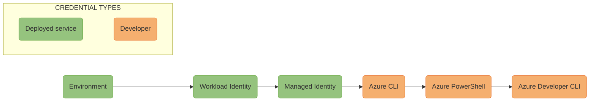

```mermaid
%% STEPS TO GENERATE IMAGE
%% =======================
%% 1. Install mermaid CLI (see https://github.com/mermaid-js/mermaid-cli/blob/master/README.md)
%%    v10.0.2 is known good for our process. npm install -g @mermaid-js/mermaid-cli@10.0.2
%% 2. Run command: mmdc -i DefaultAzureCredentialAuthFlow.md -o DefaultAzureCredentialAuthFlow.svg

flowchart LR;
    A(Environment):::deployed --> B(Workload Identity):::deployed --> C(Managed Identity):::deployed --> D(Azure CLI):::developer --> E(Azure PowerShell):::developer --> F(Azure Developer CLI):::developer;

    subgraph CREDENTIAL TYPES;
        direction LR;
        Deployed(Deployed service):::deployed ~~~ Developer(Developer):::developer;
    end;

    %% Define styles for credential type boxes
    classDef deployed fill:#95C37E, stroke:#71AD4C;
    classDef developer fill:#F5AF6F, stroke:#EB7C39;

    %% Add API ref links to credential type boxes
    click A "https://learn.microsoft.com/javascript/api/@azure/identity/environmentcredential?view=azure-node-latest" _blank;
    click B "https://learn.microsoft.com/javascript/api/@azure/identity/workloadidentitycredential?view=azure-node-latest" _blank;
    click C "https://learn.microsoft.com/javascript/api/@azure/identity/managedidentitycredential?view=azure-node-latest" _blank;
    click D "https://learn.microsoft.com/javascript/api/@azure/identity/azureclicredential?view=azure-node-latest" _blank;
    click E "https://learn.microsoft.com/javascript/api/@azure/identity/azurepowershellcredential?view=azure-node-latest" _blank;
    click F "https://learn.microsoft.com/javascript/api/@azure/identity/azuredeveloperclicredential?view=azure-node-latest" _blank;
```
