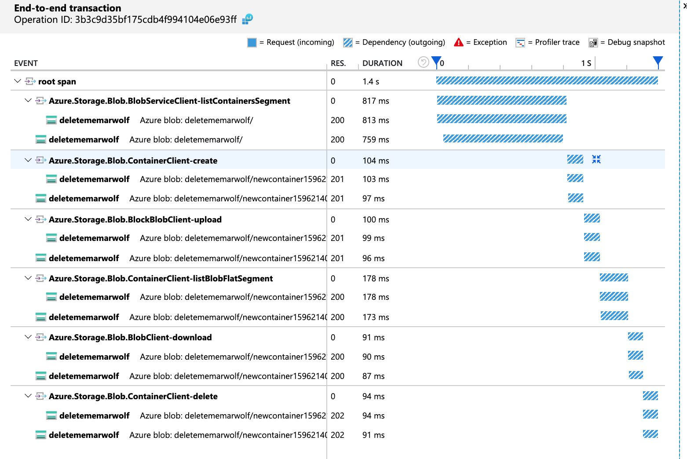

# Getting started with samples

Code cloned from [azure-sdk-for-js/storage-blob/samples](https://github.com/Azure/azure-sdk-for-js/tree/master/sdk/storage/storage-blob/samples).

## `@azure/monitor-opentelemetry-exporter`

All changes required to enable exporting trace data to Azure Monitor were made in `tracing.ts` / `tracing.js`.

In order for auto-instrumentation to take effect, `tracing` must be imported **before** you `import` or `require` any other module into your application!.



## Get account credentials of your storage account

- In the [Azure Portal](https://portal.azure.com), go to **Dashboard > Storage > _your-storage-account_**.
- Note down the "AccountName", "AccountKey" obtained at **Access keys** and "AccountSAS" from **Shared access signature** under **Settings** tab.
  Before running any of the samples, update with the credentials you have noted down above.

### Authenticating with Azure Active Directory

If you have [registered an application](https://docs.microsoft.com/azure/active-directory/develop/quickstart-register-app) with an Azure Active Directory tenant, you can [assign it to an RBAC role](https://docs.microsoft.com/azure/storage/common/storage-auth-aad) in your Azure Storage account. This enables you to use the Azure.Identity library to authenticate with Azure Storage as shown in the [azureAdAuth.ts sample](https://github.com/Azure/azure-sdk-for-js/blob/master/sdk/storage/storage-blob/samples/typescript/src/azureAdAuth.ts).

## JavaScript sample

Copy the sample to your samples folder and use `node` to run it.

```bash
node sample.js
```

## TypeScript sample

If you don't have Typescript installed, then use `npm` to install it first.

```bash
npm install -g typescript
```

One way to run Typescript samples is to use `ts-node`. To run `ts-node`, run the below in your sample folder

```bash
npx ts-node sample.ts
```

## Browser sample

Currently, the Azure Monitor OpenTelemetry Exporter only supports Node.js environments. This sample will be updated once browser support becomes available.

<!-- Running these samples in the browser requires a bundler. While we give examples using Webpack, any bundler will do!

First, install webpack and webpack-cli.

```bash
npm install --save-dev webpack webpack-cli
```

Next, run webpack on the sample code to produce an optimized browser bundle.

```bash
npx webpack sample.js
```

This will produce `dist/main.js`. Reference this file in an HTML file script tag and open the file in a browser to run the sample.

```html
<script src="./dist/main.js"></script>
``` -->
