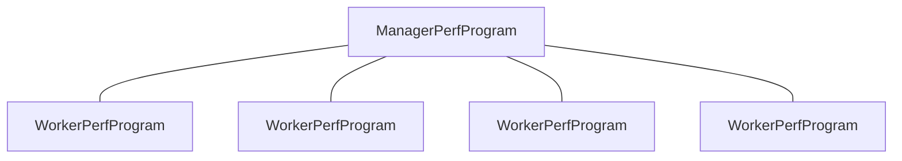
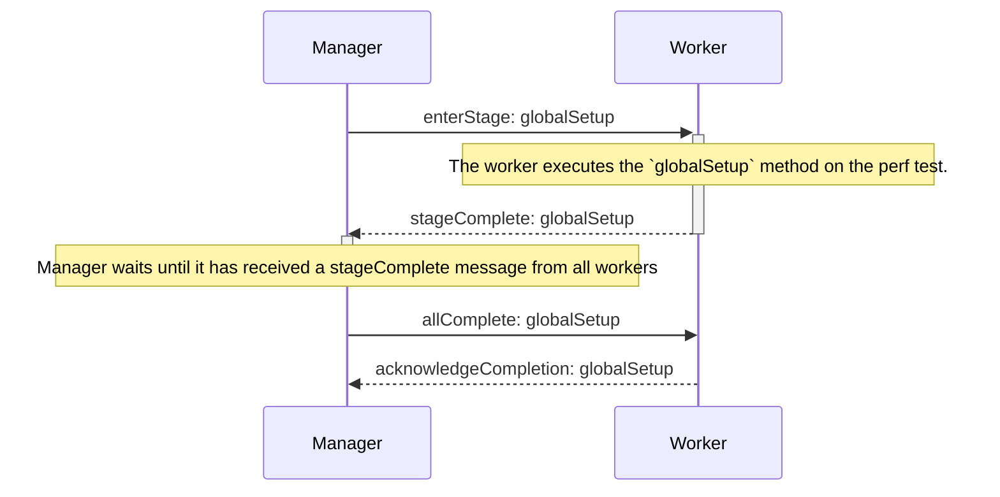

# Azure Perf library for JavaScript

## Getting started

To start a new perf test project for the your SDK in the js repository, follow the steps in the [GettingStarted.md](https://github.com/Azure/azure-sdk-for-js/blob/main/sdk/test-utils/perf/GettingStarted.md).

Link to the wiki - [Writing-Performance-Tests](https://github.com/Azure/azure-sdk-for-js/wiki/Writing-Performance-Tests) (has the same contents as the GettingStarted docs)

## KeyConcepts

- A **PerfTest** test is a test that will be executed repeatedly to show both the performance of the program, and how it behaves under stress.
- Tests have an asynchronous method called `run` which is executed based on the duration, iterations, and parallel options provided for the perf test. More about options below.
- A **PerfOption** is a command line parameter. We use `minimist` to parse them appropriately, and then to consolidate them in a dictionary of options that is called `PerfOptionDictionary<string>`. The dictionary class accepts a union type of strings that defines the options that are allowed by each test.
- Some default options are parsed by the Perf program. Their longer names are: `help`, `no-cleanups`, `parallel`, `duration`, `warmup`, `iterations`, `no-cleanup` and `milliseconds-to-log`.
- Perf tests are executed as many times as possible until the `duration` parameter is specified. This process may repeat as many `iterations` are given. Before each iteration, tests might be called for a period of time up to `warmup`, to adjust to possible runtime optimizations. In each iteration, as many as `parallel` instances of the same test are called without waiting for each other, letting the event loop decide which one is prioritized (it's not true parallelism, but it's an approximation that aligns with the design in other languages, we might improve it over time).
- Each test can have a `globalSetup` method, which is called once per CPU before the process begins, a `globalCleanup` method, which is called once per CPU after the process finishes.
- Each test can have a `setup` method, which is called as many times as test instances are created (up to `parallel`), and help specify local state for each test instance. A `cleanup` method is also optional, called the same amount of times, but after finishing running the tests.
- `test-proxies` url option - this option can be leveraged to avoid hitting throttling scenarios while testing the services. This option lets the requests go through proxy server(s) based on the url(s) provided, we run the `run` method once in record mode to save the requests and responses in memory and then a ton of times in playback. Workflow with the test-proxies below.
- `parallel` and `cpus` options: `cpus` specifies the number of CPU cores to distribute parallel runs across; `parallel` specifies the number of parallel runs to perform.
- `use-worker-threads` option: when running on multiple CPUs, set to true to use the Node worker threads module. Defaults to false, in which case the child process module is used.

## Multi-core perf testing and parallelism

### Overview

The perf framework has a `--parallels` option which controls the number of parallel executions that are run simultaneously during the perf test. By default, these parallel executions are split evenly across the number of CPUs available on the machine. The number of CPUs that the parallel runs are split across can be controlled manually using the `--cpus` option.

To achieve multi-core perf testing, a manager-worker architecture is used. When the perf framework is first run, a manager process is created, which is responsible for spawning a number of worker processes corresponding to the number of CPUs.

<em>Figure: In the case of 4 CPUs being used, the manager creates 4 worker processes. Messages are exchanged between the manager and each worker for synchronization and reporting of results.</em>

Each worker process is allocated a number of parallel runs by the manager. The manager is responsible for (i) synchronizing all the workers and controlling the perf test run's lifecycle, and (ii) receiving, collating, and reporting results from each of the workers. Each worker is responsible for (i) executing its assigned parallel runs and (ii) sending results and status updates to the manager process.

By default, each of the workers is a child process of the manager program, created using the Node [`child_process` module](https://nodejs.org/api/child_process.html). The `--use-worker-threads` flag can be used to create workers using the newer [`worker_threads` module](https://nodejs.org/api/worker_threads.html) instead. Note that the use of worker threads may cause performance degradation when using Node 14 or lower.

### Synchronization

A barrier construct is used to ensure that each worker follows the same timing. The perf test run is split into a number of stages:

- Global setup
- Setup
- Post-setup
- Warmup
- Test (one 'test' stage per iteration specified with the `--iterations` option)
- Pre-cleanup
- Cleanup
- Global cleanup

Each worker waits for a message from the manager to before entering each stage, and can only proceed out of the stage once all the other workers have completed the stage. The manager is responsible for telling the workers to start a stage and for sending messages to workers once all the other workers have completed a stage. The diagram below shows how the manager and a worker communicates over the course of a stage:

<em>Figure: example flow of synchronization messages between the manager and a worker during a stage (globalSetup in this case).</em>

## Workflow with test proxy

Steps below constitute the workflow of a typical perf test.

- test resources are setup
  - hitting the live service
- then start record
  - making a request to the proxy server to start recording
  - proxy server gives a recording id, we'll use this id to save the actual requests and responses
- run the `run` method once
  - proxy-server saves all the requests and responses in memory
- stop record
  - making a request to the proxy server to stop recording
- start playback
  - making a request to the proxy server to start playback
  - we use the same recording-id that we used in the record mode since that's the only way proxy-server knows what requests are supposed to be played back
  - As a response, we get a new recording-id, which will be used for future playback requests
- run the `run` method again
  - based on the duration, iterations, and parallel options provided for the perf test
  - all the requests in the `run` method are played back since we have already recorded them before
- when the `run` loops end, stop playback
  - making a request to the proxy server to stop playing back
- delete the live resources that we have created before

## Examples

Check the [test folder](https://github.com/Azure/azure-sdk-for-js/blob/main/sdk/test-utils/perf/test/).

## Running the tests in `/test` folder

> `npm run perf-test:node -- ${testClassName} ${options}`

### Example

> `npm run perf-test:node -- NoOp --parallel 2 --duration 7 --iterations 2 --warmup 2`

If you would like to run all the tests at once in sequence, use the following command

> `rushx test:node`

## Troubleshooting

TODO

## Next steps

Check the [source](https://github.com/Azure/azure-sdk-for-js/blob/main/sdk/test-utils/perf/src/) folder and the [test folder](https://github.com/Azure/azure-sdk-for-js/blob/main/sdk/test-utils/perf/test/).

Also check the Perf EPIC, here: https://github.com/Azure/azure-sdk-for-js/issues/8057

## Contributing

If you'd like to contribute to this library, please read the [contributing guide](https://github.com/Azure/azure-sdk-for-js/blob/main/CONTRIBUTING.md) to learn more about how to build and test the code.

