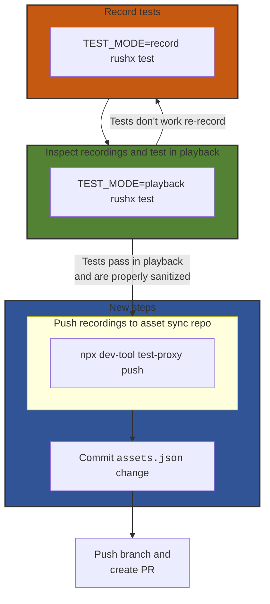

# Migrating recordings to the `azure-sdk-assets` repository

# Background

Recordings take up a large amount of space in our repository and generate a lot of churn. The asset sync project, owned by our Engineering System team, is a solution to this problem. Leveraging and extending the existing test proxy, the asset sync extension adds support for moving the recordings outside of the main azure-sdk-for-js repo.

## Performing the migration

### Prerequisites

To be able to leverage the asset-sync workflow

- To push recordings to the `"azure-sdk-assets"` repo, you need **write-access** to the assets repo.
  - [Permissions to `Azure/azure-sdk-assets`](https://dev.azure.com/azure-sdk/internal/_wiki/wikis/internal.wiki/785/Externalizing-Recordings-(Asset-Sync)?anchor=permissions-to-%60azure/azure-sdk-assets%60)
- Install [Powershell]
  - Make sure "pwsh" command works at this step (If you follow the above link, "pwsh" is typically added to the system environment variables by default)
- Add `dev-tool` to the `devDependencies` in the `package.json`.

_If you are working on a new package and don't have any recorded tests, skip to [New Package - No Recorded Tests](#new-package---no-recorded-tests)._

The package you are migrating needs to be using the new version of the recorder that uses the test proxy (`@azure-tools/test-recorder@^3.0.0`). If you're on an older version, follow [recorder 3.0 migration guide] first.

## Migration

If your package is new with no recorded tests, skip to the next section [New Package - No Recorded Tests](#new-package---no-recorded-tests)

Run the following command to migrate the recordings.

```bash
$ npx dev-tool test-proxy migrate --initial-push
```

_Note: If you [install `dev-tool` globally], you don't need `npx` prefix in the above command_

Once this is done, validate that your recorded tests still pass, and create a PR with the changes. That's it!

The above `migrate` command produces an `assets.json`, with a tag pointing to your recordings in the `Azure/azure-sdk-assets` repository.

Example `assets.json` from "keyvault-certificates" SDK.

```json
{
  "AssetsRepo": "Azure/azure-sdk-assets",
  "AssetsRepoPrefixPath": "js",
  "TagPrefix": "js/keyvault/keyvault-certificates",
  "Tag": "js/keyvault/keyvault-certificates_43821e21b3"
}
```

And the recordings are located at https://github.com/Azure/azure-sdk-assets/tree/js/keyvault/keyvault-certificates_43821e21b3

## New Package - No Recorded Tests

_If you already have an `assets.json` file, skip to [Workflow with asset sync enabled](#workflow-with-asset-sync-enabled)._

This section assumes that your package is new to the JS repo and that you're trying to onboard your tests with recorder, and the asset-sync workflow.

From the root of the repo, navigate to your package

```
cd sdk/<service-folder>/<package-name>
```

Generate an `sdk/<service-folder>/<package-name>/assets.json` file by running the following command.

```
npx dev-tool test-proxy init
```

This command would generate an `assets.json` file with an empty tag.

## Workflow with asset sync enabled

At this point, you should have an `assets.json` file under your SDK.
`sdk/<service-folder>/<package-name>/assets.json`.

Run your tests using the usual [package.json scripts].

`rushx integration-test:node`, for example.

With asset sync enabled, there is one extra step that must be taken before you create a PR with changes to recorded tests: you must push the new recordings to the assets repo. This is done with the following command:

```bash
npx dev-tool test-proxy push
```

This command will:

1. Push your local recordings to a tag in the `Azure/azure-sdk-assets` repo, and
1. Update the `assets.json` in your package root to reference the newly created tag.

You should stage and commit the `assets.json` update as part of your PR. If you don't run the `push` command before creating a PR, the CI (and anyone else who tries to run your recorded tests) will use the old recordings, which will cause failures.

After onboarding your new package or after migrating your package to the asset-sync workflow, the following diagram describes the new workflow (new steps highlighted):



## Inspecting recordings with asset sync enabled

Often, when re-recording tests, you will want to inspect the recordings that have been made, either to debug something or to make sure secrets have been sanitized properly. With asset sync workflow enabled, the recordings are no longer stored in the same place as your SDK. You'll need to follow the following process to find them:

1. Navigate to the root of the `azure-sdk-for-js` repo.
1. Go into the `.assets` directory. This will contain a file called `.breadcrumb`; open it and find the entry that matches your SDK. This will give you the name of the directory within `.assets` that your recordings are located in.
1. Once in that directory, you can do a `git status` to see what uncommitted changes you have made to the recordings, and you can inspect the recordings in whatever way you'd like.

There is an [open issue](https://github.com/Azure/azure-sdk-tools/issues/4652) to streamline this process by providing tooling to get you to the right directory without you having to look inside the `.breadcrumb` file. Watch this space.

For more information on this topic, see the [asset sync reference documentation][asset-sync-reference].

### Through VS Code [GIT Source Control](https://code.visualstudio.com/docs/sourcecontrol/overview) UI

Suppose you want to update the recording for a test, you'll re-run the test like below.


The changes in the recordings can be seen in the GIT Source Control section in VS Code.

(Installing GIT should be enough to get this view. [VS Code Source control overview](https://code.visualstudio.com/docs/sourcecontrol/overview))

Click the file on the left side to view the diff for it on the right side as shown below.


## Other `test-proxy` commands

A few commands have been added to `dev-tool` to facilitate pushing and fetching the recordings to and from your local:

- `dev-tool test-proxy push`: use this command to push recordings to the assets repo when you have finished re-recording. This command will push your changes to the assets repo and update the tag in `assets.json` to reference the newly pushed recordings. The change to `assets.json` must be checked in for the test proxy to use the new recordings outside of your local environment.
- `dev-tool test-proxy restore`: this command will pull the recordings from the assets repo that are referenced in your `assets.json`. Typically this will be done automatically when you first run recorded tests if the recordings haven't been downloaded already, but you can run this command in advance if you'd like to download them earlier, for example for offline work.
- `dev-tool test-proxy reset`: if you've made any changes to the recordings locally, you can use this to revert those local changes and reset to what is currently checked in to the assets repo. This is a destructive operation and if you have local changes it will prompt you before removing your work.
- `dev-tool test-proxy migrate`: used for migrating existing recordings to the assets repo as described above.

**Refer to [testing-commands](https://github.com/Azure/azure-sdk-for-js/wiki/Golden-Testing-Commands) guide if you need help on the commands to run during testing.**

## Working offline

Offline work is supported out-of-the-box. Of course, however, you won't be able to push or pull from the assets repo while offline. You can fetch recordings from the assets repo by running `npx dev-tool test-proxy restore`. This will download the recordings (and the test proxy executable, if you haven't got that already), making them ready for you to run tests with.

## Further reading

[recorder 3.0 migration guide]: https://github.com/Azure/azure-sdk-for-js/blob/main/sdk/test-utils/recorder/MIGRATION.md
[asset-sync-reference]: https://github.com/Azure/azure-sdk-tools/tree/main/tools/test-proxy/documentation/asset-sync
[powershell]: https://github.com/PowerShell/PowerShell
[install `dev-tool` globally]: https://github.com/Azure/azure-sdk-for-js/tree/main/common/tools/dev-tool#installation
[package.json scripts]: https://github.com/Azure/azure-sdk-for-js/blob/main/sdk/test-utils/recorder/README.md#packagejson-scripts
