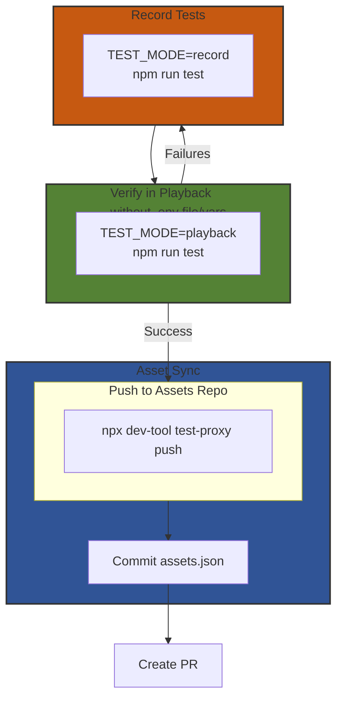

# Migrating recordings to the `azure-sdk-assets` repository

## Table of Contents
- [Migrating recordings to the `azure-sdk-assets` repository](#migrating-recordings-to-the-azure-sdk-assets-repository)
  - [Table of Contents](#table-of-contents)
  - [Background](#background)
  - [Prerequisites](#prerequisites)
  - [New Package - No Recorded Tests](#new-package---no-recorded-tests)
  - [Workflow with Asset Sync enabled](#workflow-with-asset-sync-enabled)
  - [Migration Steps for Existing Recordings](#migration-steps-for-existing-recordings)
  - [Inspecting Recordings with Asset Sync enabled](#inspecting-recordings-with-asset-sync-enabled)
    - [Through VS Code GIT Source Control UI](#through-vs-code-git-source-control-ui)
  - [Test-Proxy Commands](#test-proxy-commands)
  - [Working Offline](#working-offline)
  - [Troubleshooting](#troubleshooting)
    - [Error: Permission denied to azure-sdk-assets repository](#error-permission-denied-to-azure-sdk-assets-repository)
    - [Error: Powershell command not found](#error-powershell-command-not-found)
    - [Tests fail in playback mode after migration](#tests-fail-in-playback-mode-after-migration)
    - [Changes not appearing in recordings](#changes-not-appearing-in-recordings)
    - [Tests work in CI but fail locally](#tests-work-in-ci-but-fail-locally)
  - [Frequently Asked Questions](#frequently-asked-questions)
  - [Further Reading](#further-reading)

## Background

Recordings take up a large amount of space in our repository and generate a lot of churn. The asset sync project, owned by our Engineering System team, is a solution to this problem. Leveraging and extending the existing test proxy, the asset sync extension adds support for moving the recordings outside of the main azure-sdk-for-js repo.

## Prerequisites

To be able to leverage the asset-sync workflow:

- **Repository access**:
  - You need **write-access** to the `azure-sdk-assets` repo to push recordings
  - [Request permissions here](https://dev.azure.com/azure-sdk/internal/_wiki/wikis/internal.wiki/785/Externalizing-Recordings-(Asset-Sync)?anchor=permissions-to-%60azure/azure-sdk-assets%60)
- **Tools**:
  - Install [Powershell](https://github.com/PowerShell/PowerShell)
  - Verify the `pwsh` command works in your terminal
- **Dependencies**:
  - Add `@azure/dev-tool` to the `devDependencies` in your `package.json`
  - Ensure your package has a dev dependency on `@azure-tools/test-recorder@^4.0.0` or later

## New Package - No Recorded Tests

This section is for packages that are new to the JS repo and are trying to onboard tests with `@azure-tools/test-recorder` and the asset-sync workflow.

From the root of the repo, navigate to your package:

```
cd sdk/<service-folder>/<package-name>
```

Generate an `sdk/<service-folder>/<package-name>/assets.json` file by running the following command:

```
npx dev-tool test-proxy init
```

This command will generate an `assets.json` file with an empty tag.

## Workflow with Asset Sync enabled

At this point, you should have an `assets.json` file under your SDK.
`sdk/<service-folder>/<package-name>/assets.json`.

Run your tests using the usual [package.json scripts].

`npm run test:node`, for example.

With asset sync enabled, there is one extra step that must be taken before you create a PR with changes to recorded tests: you must push the new recordings to the assets repo. This is done with the following command:

```bash
npx dev-tool test-proxy push
```

This command will:

1. Push your local recordings to a tag in the `Azure/azure-sdk-assets` repo, and
2. Update the `assets.json` in your package root to reference the newly created tag.

Example `assets.json` from "keyvault-certificates" SDK.

```json
{
  "AssetsRepo": "Azure/azure-sdk-assets",
  "AssetsRepoPrefixPath": "js",
  "TagPrefix": "js/keyvault/keyvault-certificates",
  "Tag": "js/keyvault/keyvault-certificates_43821e21b3"
}
```

And the recordings are located at https://github.com/Azure/azure-sdk-assets/tree/js/keyvault/keyvault-certificates_43821e21b3

You should stage and commit the `assets.json` update as part of your PR. If you don't run the `push` command before creating a PR, the CI (and anyone else who tries to run your recorded tests) will use the old recordings, which will cause failures.

After onboarding your new package or after migrating your package to the asset-sync workflow, the following diagram describes the new workflow (new steps highlighted):



## Migration Steps for Existing Recordings

> **Note:** Most packages should already be using the Asset Sync workflow. This section is only relevant for packages that still have recordings directly in the repository.

If you have an existing package with recordings that need to be migrated, run the following command:

```bash
$ npx dev-tool test-proxy migrate --initial-push
```

_Note: If you [install `dev-tool` globally], you don't need `npx` prefix in the above command_

Once this is done, validate that your recorded tests still pass, and create a PR with the changes. That's it!

The above `migrate` command produces an `assets.json`, with a tag pointing to your recordings in the `Azure/azure-sdk-assets` repository.


## Inspecting Recordings with Asset Sync enabled

Often, when re-recording tests, you will want to inspect the recordings that have been made, either to debug something or to make sure secrets have been sanitized properly. With asset sync workflow enabled, the recordings are no longer stored in the same place as your SDK. You'll need to follow the following process to find them:

1. Navigate to the root of the `azure-sdk-for-js` repo.
1. Go into the `.assets` directory. This will contain a file called `.breadcrumb`; open it and find the entry that matches your SDK. This will give you the name of the directory within `.assets` that your recordings are located in.
1. Once in that directory, you can do a `git status` to see what uncommitted changes you have made to the recordings, and you can inspect the recordings in whatever way you'd like.

There is an [open issue](https://github.com/Azure/azure-sdk-tools/issues/4652) to streamline this process by providing tooling to get you to the right directory without you having to look inside the `.breadcrumb` file. Watch this space.

For more information on this topic, see the [asset sync reference documentation][asset-sync-reference].

### Through VS Code [GIT Source Control](https://code.visualstudio.com/docs/sourcecontrol/overview) UI

Suppose you want to update the recording for a test, you'll re-run the test like below.


The changes in the recordings can be seen in the GIT Source Control section in VS Code.

(Installing GIT should be enough to get this view. [VS Code Source control overview](https://code.visualstudio.com/docs/sourcecontrol/overview))

Click the file on the left side to view the diff for it on the right side as shown below.


## Test-Proxy Commands

A few commands have been added to `dev-tool` to facilitate pushing and fetching the recordings to and from your local:

- `dev-tool test-proxy push`: use this command to push recordings to the assets repo when you have finished re-recording. This command will push your changes to the assets repo and update the tag in `assets.json` to reference the newly pushed recordings. The change to `assets.json` must be checked in for the test proxy to use the new recordings outside of your local environment.
- `dev-tool test-proxy restore`: this command will pull the recordings from the assets repo that are referenced in your `assets.json`. Typically this will be done automatically when you first run recorded tests if the recordings haven't been downloaded already, but you can run this command in advance if you'd like to download them earlier, for example for offline work.
- `dev-tool test-proxy reset`: if you've made any changes to the recordings locally, you can use this to revert those local changes and reset to what is currently checked in to the assets repo. This is a destructive operation and if you have local changes it will prompt you before removing your work.
- `dev-tool test-proxy migrate`: used for migrating existing recordings to the assets repo as described above.

**Refer to [testing-commands](https://github.com/Azure/azure-sdk-for-js/wiki/Golden-Testing-Commands) guide if you need help on the commands to run during testing.**

## Working Offline

Offline work is supported out-of-the-box. Of course, however, you won't be able to push or pull from the assets repo while offline. You can fetch recordings from the assets repo by running `npx dev-tool test-proxy restore`. This will download the recordings (and the test proxy executable, if you haven't got that already), making them ready for you to run tests with.

## Troubleshooting

Common issues and their solutions:

### Error: Permission denied to azure-sdk-assets repository
- Verify you have write access to the `Azure/azure-sdk-assets` repository
- Check that your Git credentials are properly configured

### Error: Powershell command not found
- Ensure Powershell is installed and the `pwsh` command is in your `PATH`
- Try reinstalling Powershell if necessary

### Tests fail in playback mode after migration
- Check that your `assets.json` is properly committed and contains the correct tag
- Try running `npx dev-tool test-proxy restore` to ensure you have the latest recordings
- Examine the error logs for specific sanitization or playback issues

### Changes not appearing in recordings
- Verify you're running tests in record mode with `TEST_MODE=record`
- Run `npx dev-tool test-proxy push` after recording
- Check if the changes appear in the `.assets` directory

### Tests work in CI but fail locally
If tests run in playback mode successfully in the CI pipelines but fail on your local machine, it is likely that your local environment or recordings might be corrupted
- **Reset your recordings**: Delete the `.assets` folder in the root of the repository to remove all pulled recordings and give yourself a clean slate
- Then run `npx dev-tool test-proxy restore` to pull fresh copies of the recordings

This is particularly helpful when you've been switching branches or if there have been significant recording changes

## Frequently Asked Questions

**Q: Do I need to migrate all packages at once?**
A: No, migration can be done package by package at your convenience.

**Q: What happens to old recordings after migration?**
A: They remain in the Git history but should be removed from the current branch.

**Q: Can I test the migration process without pushing to the assets repo?**
A: Yes, you can perform all steps locally until the final `push` command.

**Q: How do CI systems access the recordings?**
A: CI systems use the tag reference in `assets.json` to retrieve recordings automatically.

**Q: Is there a size limit to recordings in the assets repo?**
A: While there's no strict limit, it's good practice to keep recordings as small as possible. Consider sanitizing large response bodies or using customization to reduce recording size.

**Q: What if I make a mistake during migration? Can I redo it?**
A: Yes, you can rerun the migration process. Just be aware that it will create a new tag in the assets repo.

**Q: Do I need special permissions to run tests locally in playback mode?**
A: No, you don't need any special permissions to run tests in playback mode. The recordings will be downloaded automatically from the public assets repo.

## Further Reading

[asset-sync-reference]: https://github.com/Azure/azure-sdk-tools/tree/main/tools/test-proxy/documentation/asset-sync
[powershell]: https://github.com/PowerShell/PowerShell
[install `dev-tool` globally]: https://github.com/Azure/azure-sdk-for-js/tree/main/common/tools/dev-tool#installation
[package.json scripts]: https://github.com/Azure/azure-sdk-for-js/blob/main/sdk/test-utils/recorder/README.md#packagejson-scripts
